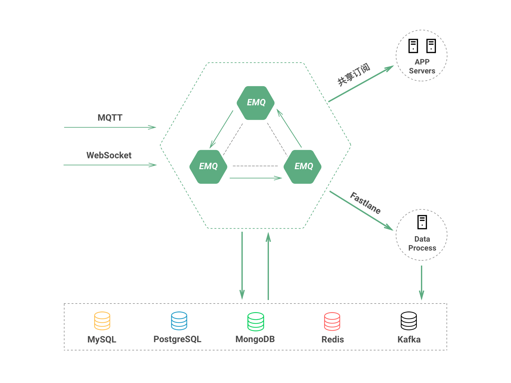

# EMQPLUS企业版中文文档(R2)

EMQPLUS企业版是基于EMQ开源消息服务器开发设计的商业服务版本。EMQPLUS企业版支持更稳定的节点集群与更高性能的消息路由，支持消息数据存储Redis、MySQL、PostgreSQL与MongoDB等多种数据库，并由专业团队提供技术支持与咨询服务。EMQPLUS企业版可帮助客户快速开发基于MQTT协议的物联网、车联网、智能硬件和移动消息应用。

## 版权

杭州小莉科技有限公司 https://emqtt.com/

