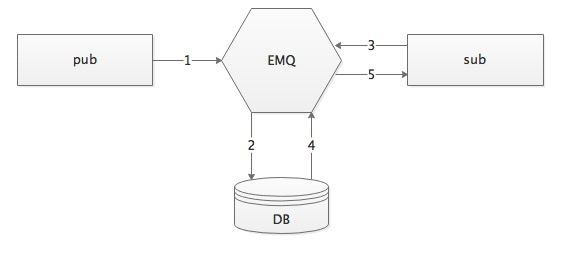

.. _backends:

========
数据存储
========

.. _backend_list:

*EMQ* 企业版消息服务器通过模块注册和钩子(Hooks)机制，定制服务器消息存储业务功能。

*EMQ* 企业版官方提供的消息存储插件包括:

+---------------------------+---------------------------+
| 插件                      | 说明                      |
+===========================+===========================+
|  emq_backend_redis        | Redis消息存储             |
+---------------------------+---------------------------+
|  emq_backend_mysql        | MySQL消息存储             |
+---------------------------+---------------------------+
|  emq_backend_pgsql        | PostgreSQL消息存储        |
+---------------------------+---------------------------+
|  emq_backend_mongo        | MongoDB消息存储           |
+---------------------------+---------------------------+

.. _backend_design:

----------
消息存储设计
----------

消息队列模型设计:

1. pub端发布一条消息
2. backend把消息记录在数据库中
3. sub端订阅主题
4. backend从数据库中获取该主题的消息
5. 发送消息给sub端
6. 从数据库中移除该消息

消息发布/订阅模型设计:

.. image:: ./_static/images/backend_pubsub.png

1. pub端发布一条消息
2. backend把消息记录在数据库中
3. sub1和sub2订阅主题
4. backend从数据库中获取该主题的消息
5. 发送消息给sub1和sub2
6. 记录sub1和sub2已读消息位置,下次获取消息从该位置开始

.. _redis_backend:

------------
Redis消息存储
------------

配置Redis消息存储
-----------------------

etc/plugins/emq_backend_redis.conf:

.. code-block:: properties

    ## Redis Server
    backend.redis.pool1.server = 127.0.0.1:6379

    ## Redis Pool Size 
    backend.redis.pool1.pool_size = 8

    ## Redis database 
    backend.redis.pool1.database = 1

    ## Redis subscribe channel
    backend.redis.pool1.channel = mqtt_channel
    
    ## Expired after seconds, if =< 0 take the default value
    backend.redis.msg.expired_after = 3600
    
    ## Client Connected Record 
    backend.redis.hook.client.connected.1    = {"action": {"function": "on_client_connected"}, "pool": "pool1"}

    ## Subscribe Lookup Record 
    backend.redis.hook.client.connected.2    = {"action": {"function": "on_subscribe_lookup"}, "pool": "pool1"}

    ## Client DisConnected Record 
    backend.redis.hook.client.disconnected.1 = {"action": {"function": "on_client_disconnected"}, "pool": "pool1"}

    ## Lookup Unread Message for one QOS > 0
    backend.redis.hook.session.subscribed.1  = {"topic": "queue/#", "action": {"function": "on_message_fetch_for_queue"}, "pool": "pool1"}
    
    ## Lookup Unread Message for many QOS > 0
    backend.redis.hook.session.subscribed.2  = {"topic": "pubsub/#", "action": {"function": "on_message_fetch_for_pubsub"}, "pool": "pool1"}

    ## Lookup Retain Message 
    backend.redis.hook.session.subscribed.3  = {"action": {"function": "on_retain_lookup"}, "pool": "pool1"}

    ## Store Publish Message  QOS > 0
    backend.redis.hook.message.publish.1     = {"topic": "#", "action": {"function": "on_message_publish"}, "pool": "pool1"}

    ## Store Retain Message 
    backend.redis.hook.message.publish.2     = {"topic": "#", "action": {"function": "on_message_retain"}, "pool": "pool1"}

    ## Delete Retain Message 
    backend.redis.hook.message.publish.3     = {"topic": "#", "action": {"function": "on_retain_delete"}, "pool": "pool1"}

    ## Store Ack for one
    backend.redis.hook.message.acked.1       = {"topic": "queue/#", "action": {"function": "on_message_acked_for_queue"}, "pool": "pool1"}
    
    ## Store Ack for many
    backend.redis.hook.message.acked.2       = {"topic": "pubsub/#", "action": {"function": "on_message_acked_for_pubsub"}, "pool": "pool1"}

*backend* 消息存储规则包括:

+------------------------+------------------------+-------------------------+----------------------------------+
| hook                   | topic                  | action/function         | 说明                             |
+========================+========================+=========================+==================================+
| client.connected       |                        | on_client_connected     | 存储客户端在线状态               |
+------------------------+------------------------+-------------------------+----------------------------------+
| client.connected       |                        | on_subscribe_lookup     | 订阅主题                         |
+------------------------+------------------------+-------------------------+----------------------------------+
| client.disconnected    |                        | on_client_disconnected  | 存储客户端离线状态               |
+------------------------+------------------------+-------------------------+----------------------------------+
| session.subscribed     | queue/#                | on_message_fetch_all_msg| 获取一对一离线消息               |
+------------------------+------------------------+-------------------------+----------------------------------+
| session.subscribed     | pubsub/#               | on_message_fetch        | 获取一对多离线消息               |
+------------------------+------------------------+-------------------------+----------------------------------+
| session.subscribed     | #                      | on_retain_lookup        | 获取retain消息                   |
+------------------------+------------------------+-------------------------+----------------------------------+
| message.publish        | #                      | on_message_publish      | 存储发布消息                     |
+------------------------+------------------------+-------------------------+----------------------------------+
| message.publish        | #                      | on_message_retain       | 存储retain消息                   |
+------------------------+------------------------+-------------------------+----------------------------------+
| message.publish        | #                      | on_retain_delete        | 删除retain消息                   |
+------------------------+------------------------+-------------------------+----------------------------------+
| message.acked          | queue/#                | on_message_acked_del_msg| 一对一消息ACK处理                |
+------------------------+------------------------+-------------------------+----------------------------------+
| message.acked          | pubsub/#               | on_message_acked        | 一对多消息ACK处理                |
+------------------------+------------------------+-------------------------+----------------------------------+

*自定义redis commands* 可用参数包括:

+----------------------+-----------------------------------------------+-----------------------------------------+
| hook                 | 可用参数                                      | 示例(每个字段分隔，必须是一个空格)      |
+======================+===============================================+=========================================+
| client.connected     | clientid                                      | SET conn:${clientid} clientid           |
+----------------------+-----------------------------------------------+-----------------------------------------+
| client.disconnected  | clientid                                      | SET disconn:${clientid} clientid        |
+----------------------+-----------------------------------------------+-----------------------------------------+
| session.subscribed   | clientid, topic, qos                          | HSET sub:${clientid} topic qos          |
+----------------------+-----------------------------------------------+-----------------------------------------+
| session.unsubscribed | clientid, topic, qos                          | HSET unsub:${clientid} topic qos        |
+----------------------+-----------------------------------------------+-----------------------------------------+
| message.publish      | message, msgid, topic, payload, qos, clientid | RPUSH pub:${topic} msgid                |
+----------------------+-----------------------------------------------+-----------------------------------------+
| message.acked        | msgid, topic, payload, qos, clientid          | HSET ack:${clientid} topic msgid        |
+----------------------+-----------------------------------------------+-----------------------------------------+
| message.delivered    | msgid, topic, payload, qos, clientid          | HSET delivered:${clientid} topic msgid  |
+----------------------+-----------------------------------------------+-----------------------------------------+

配置redis commands:

考虑到用户的需求不同,backend redis自带的函数无法满足用户需求, 用户还可以根据自己的需求配置redis commands
在etc/plugins/emq_backend_redis.conf中添加如下配置:

.. code-block:: properties
    
    ## 在客户端连接到EMQ服务器后，执行一条redis命令(支持多条redis命令) 
    backend.redis.hook.client.connected.3 = {"action": {"commands": ["SET conn:${clientid} clientid"]}, "pool": "pool1"}

加载Redis存储插件
-----------------

.. code-block:: bash

    ./bin/emqctl plugins load emq_backend_redis

mqtt:client - 设备在线状态Hash
-----------------------------

*mqtt:client* Hash存储设备在线状态::

    hmset
    key = mqtt:client:${clientid} 
    value = {state:int, online_at:timestamp, offline_at:timestamp}

    hset
    key = mqtt:node:${node}
    field = ${clientid}
    value = ${ts}

查询设备在线状态::

    HGETALL "mqtt:client:${clientId}"
    
例如ClientId为test客户端上线::
    
    HGETALL mqtt:client:test
    1) "state"
    2) "1"
    3) "online_at"
    4) "1481685802"
    5) "offline_at"
    6) "undefined"
    
例如ClientId为test客户端下线::
    
    HGETALL mqtt:client:test
    1) "state"
    2) "0"
    3) "online_at"
    4) "1481685802"
    5) "offline_at"
    6) "1481685924"

mqtt:retain - Retain消息
------------------------

mqtt:retain Hash存储Retain消息::

    hmset
    key = mqtt:retain:${topic}
    value = {id: string, from: string, qos: int, topic: string, retain: int, payload: string, ts: timestamp}

查询retain消息::

    HGETALL "mqtt:retain:${topic}"

例如查看topic为topic的retain消息::
    
    HGETALL mqtt:retain:topic
     1) "id"
     2) "6P9NLcJ65VXBbC22sYb4"
     3) "from"
     4) "test"
     5) "qos"
     6) "1"
     7) "topic"
     8) "topic"
     9) "retain"
    10) "true"
    11) "payload"
    12) "Hello world!"
    13) "ts"
    14) "1481690659"
    
mqtt:msg - 消息存储
-----------------------

*mqtt:msg* Hash存储MQTT消息::

    hmset
    key = mqtt:msg:${msgid}
    value = {id: string, from: string, qos: int, topic: string, retain: int, payload: string, ts: timestamp}

    zadd
    key = mqtt:msg:${topic}
    field = 1
    value = ${msgid}

mqtt:acked - 消息确认
---------------------

*mqtt:acked* SET存储客户端消息确认::

    set
    key = mqtt:acked:${clientid}:${topic}
    value = ${msgid}

mqtt:sub - 订阅关系
----------------------------

*mqtt:sub* Hash存储订阅关系::

    hset
    key = mqtt:sub:${clientid}
    field = ${topic}
    value = ${qos}

某个客户端订阅主题::
    
    HSET mqtt:sub:${clientid} ${topic} ${qos}
    
例如为ClientId为"test"的客户端订阅主题topic0, topic1, topic2::

    HSET "mqtt:sub:test" "topic0" 0
    HSET "mqtt:sub:test" "topic1" 1
    HSET "mqtt:sub:test" "topic2" 2
    
查询ClientId为"test"的客户端已订阅主题::
 
    HGETALL mqtt:sub:test
    1) "topic0"
    2) "0"
    3) "topic1"
    4) "1"
    5) "topic2"
    6) "2"
 
SUB/UNSUB 事件发布
------------------

当客户端订阅/取消订阅主题时，EMQ向Redis发布事件消息::

    PUBLISH
    channel = "mqtt_channel"
    message = {type: string , topic: string, clientid: string, qos: int} 
    \*type: [subscribe/unsubscribe]

例如ClientId为test客户端订阅主题topic0::

    PUBLISH "mqtt_channel" "{\"type\": \"subscribe\", \"topic\": \"topic0\", \"clientid\": \"test\", \"qos\": \"0\"}"

例如ClientId为test客户端取消订阅主题::

    PUBLISH "mqtt_channel" "{\"type\": \"unsubscribe\", \"topic\": \"test_topic0\", \"clientid\": \"test\"}"

.. _mysql_backend:

------------
MySQL消息存储
------------

配置MySQL消息存储
----------------

etc/plugins/emq_backend_mysql.conf:

.. code-block:: properties

    ## Mysql Server
    backend.mysql.pool1.server = 127.0.0.1:3306

    ## Mysql Pool Size
    backend.mysql.pool1.pool_size = 8

    ## Mysql Username
    backend.mysql.pool1.user = root

    ## Mysql Password
    backend.mysql.pool1.password = public

    ## Mysql Database
    backend.mysql.pool1.database = mqtt

    ## Client Connected Record 
    backend.mysql.hook.client.connected.1    = {"action": {"function": "on_client_connected"}, "pool": "pool1"}

    ## Subscribe Lookup Record 
    backend.mysql.hook.client.connected.2    = {"action": {"function": "on_subscribe_lookup"}, "pool": "pool1"}
    
    ## Client DisConnected Record 
    backend.mysql.hook.client.disconnected.1 = {"action": {"function": "on_client_disconnected"}, "pool": "pool1"}

    ## Lookup Unread Message QOS > 0
    backend.mysql.hook.session.subscribed.1  = {"topic": "#", "action": {"function": "on_message_fetch"}, "pool": "pool1"}

    ## Lookup Retain Message 
    backend.mysql.hook.session.subscribed.2  = {"topic": "#", "action": {"function": "on_retain_lookup"}, "pool": "pool1"}

    ## Store Publish Message  QOS > 0
    backend.mysql.hook.message.publish.1     = {"topic": "#", "action": {"function": "on_message_publish"}, "pool": "pool1"}

    ## Store Retain Message 
    backend.mysql.hook.message.publish.2     = {"topic": "#", "action": {"function": "on_message_retain"}, "pool": "pool1"}

    ## Delete Retain Message 
    backend.mysql.hook.message.publish.3     = {"topic": "#", "action": {"function": "on_retain_delete"}, "pool": "pool1"}

    ## Store Ack
    backend.mysql.hook.message.acked.1       = {"topic": "#", "action": {"function": "on_message_acked"}, "pool": "pool1"}

*backend* 消息存储规则包括:

+------------------------+------------------------+-------------------------+----------------------------------+
| hook                   | topic                  | action                  | 说明                             |
+========================+========================+=========================+==================================+
| client.connected       |                        | on_client_connected     | 存储客户端在线状态               |
+------------------------+------------------------+-------------------------+----------------------------------+
| client.connected       |                        | on_subscribe_lookup     | 订阅主题                         |
+------------------------+------------------------+-------------------------+----------------------------------+
| client.disconnected    |                        | on_client_disconnected  | 存储客户端离线状态               |
+------------------------+------------------------+-------------------------+----------------------------------+
| session.subscribed     | #                      | on_message_fetch        | 获取离线消息                     |
+------------------------+------------------------+-------------------------+----------------------------------+
| session.subscribed     | #                      | on_retain_lookup        | 获取retain消息                   |
+------------------------+------------------------+-------------------------+----------------------------------+
| message.publish        | #                      | on_message_publish      | 存储发布消息                     |
+------------------------+------------------------+-------------------------+----------------------------------+
| message.publish        | #                      | on_message_retain       | 存储retain消息                   |
+------------------------+------------------------+-------------------------+----------------------------------+
| message.publish        | #                      | on_retain_delete        | 删除retain消息                   |
+------------------------+------------------------+-------------------------+----------------------------------+
| message.acked          | #                      | on_message_acked        | 消息ACK处理                      |
+------------------------+------------------------+-------------------------+----------------------------------+

*自定义sql 语句* 可用参数包括:

+----------------------+---------------------------------------+----------------------------------------------------------------+
| hook                 | 可用参数                              | 示例(sql语句中${name} 表示可获取的参数)                        |
+======================+=======================================+================================================================+
| client.connected     | clientid                              | insert into conn(clientid) values(${clientid})                 |
+----------------------+---------------------------------------+----------------------------------------------------------------+
| client.disconnected  | clientid                              | insert into disconn(clientid) values(${clientid})              |
+----------------------+---------------------------------------+----------------------------------------------------------------+
| session.subscribed   | clientid, topic, qos                  | insert into sub(topic, qos) values(${topic}, ${qos})           |
+----------------------+---------------------------------------+----------------------------------------------------------------+
| session.unsubscribed | clientid, topic, qos                  | delete from sub where topic = ${topic}                         |
+----------------------+---------------------------------------+----------------------------------------------------------------+
| message.publish      | msgid, topic, payload, qos, clientid  | insert into msg(msgid, topic) values(${msgid}, ${topic})       |
+----------------------+---------------------------------------+----------------------------------------------------------------+
| message.acked        | msgid, topic, payload, qos, clientid  | insert into ack(msgid, topic) values(${msgid}, ${topic})       |
+----------------------+---------------------------------------+----------------------------------------------------------------+
| message.delivered    | msgid, topic, payload, qos, clientid  | insert into delivered(msgid, topic) values(${msgid}, ${topic}) |
+----------------------+---------------------------------------+----------------------------------------------------------------+

支持sql语句配置:

考虑到用户的需求不同,backend mysql自带的函数无法满足用户需求, 用户可根据自己的需求配置sql语句

在etc/plugins/emq_backend_mysql.conf中添加如下配置:

.. code-block:: properties

    ## 在客户端连接到EMQ服务器后，执行一条sql语句(支持多条sql语句) 
    backend.mysql.hook.client.connected.3 = {"action": {"sql": ["insert into conn(clientid) values(${clientid})"]}, "pool": "pool1"}

加载MySQL存储插件
-----------------

.. code-block:: bash    

    ./bin/emqctl plugins load emq_backend_mysql

MySQL数据库
----------
    
.. code-block:: sql

    create database mqtt;

导入MySQL表结构
--------------
    
.. code-block:: bash
    
    mysql -u root -p mqtt < etc/sql/emq_backend_mysql.sql

*NOTE*:: 数据库名称可自定义

MySQL 用户状态表(Client Table)
---------------------------------

*mqtt_client* 存储设备在线状态::

    DROP TABLE IF EXISTS `mqtt_client`;
    CREATE TABLE `mqtt_client` (
      `id` int(11) unsigned NOT NULL AUTO_INCREMENT,
      `clientid` varchar(64) DEFAULT NULL,
      `state` varchar(3) DEFAULT NULL,
      `node` varchar(100) DEFAULT NULL,
      `online_at` datetime DEFAULT NULL,
      `offline_at` datetime DEFAULT NULL,
      `created` timestamp NULL DEFAULT CURRENT_TIMESTAMP,
      PRIMARY KEY (`id`),
      KEY `mqtt_client_idx` (`clientid`),
      UNIQUE KEY `mqtt_client_key` (`clientid`)
    ) ENGINE=InnoDB DEFAULT CHARSET=utf8;

查询设备在线状态::

    select * from mqtt_client where clientid = ${clientid};
    
例如ClientId为test客户端上线::

    select * from mqtt_client where clientid = "test";
    
    +----+----------+-------+------------------+---------------------+---------------------+---------------------+
    | id | clientid | state | node             | online_at           | offline_at          | created             |
    +----+----------+-------+------------------+---------------------+---------------------+---------------------+
    |  1 | test     | 1     | emqttd@127.0.0.1 | 2016-11-15 09:40:40 | NULL                | 2016-12-24 09:40:22 |
    +----+----------+-------+------------------+---------------------+---------------------+---------------------+
    1 rows in set (0.00 sec)

例如ClientId为test客户端下线::

    select * from mqtt_client where clientid = "test";
    
    +----+----------+-------+------------------+---------------------+---------------------+---------------------+
    | id | clientid | state | node             | online_at           | offline_at          | created             |
    +----+----------+-------+------------------+---------------------+---------------------+---------------------+
    |  1 | test     | 0     | emqttd@127.0.0.1 | 2016-11-15 09:40:40 | 2016-11-15 09:46:10 | 2016-12-24 09:40:22 |
    +----+----------+-------+------------------+---------------------+---------------------+---------------------+
    1 rows in set (0.00 sec)

MySQL 用户订阅主题表(Sub Table)
-------------------------------------------

*mqtt_sub* 存储订阅关系::

    DROP TABLE IF EXISTS `mqtt_sub`;
    CREATE TABLE `mqtt_sub` (
      `id` int(11) unsigned NOT NULL AUTO_INCREMENT,
      `clientid` varchar(64) DEFAULT NULL,
      `topic` varchar(256) DEFAULT NULL,
      `qos` int(3) DEFAULT NULL,
      `created` timestamp NULL DEFAULT CURRENT_TIMESTAMP,
      PRIMARY KEY (`id`),
      KEY `mqtt_sub_idx` (`clientid`,`topic`(255),`qos`),
      UNIQUE KEY `mqtt_sub_key` (`clientid`,`topic`)
    ) ENGINE=InnoDB DEFAULT CHARSET=utf8;

用户test分别订阅主题test_topic0 test_topic1 test_topic2::

    insert into mqtt_sub(clientid, topic, qos) values("test", "test_topic0", 0);
    insert into mqtt_sub(clientid, topic, qos) values("test", "test_topic1", 1);
    insert into mqtt_sub(clientid, topic, qos) values("test", "test_topic2", 2);

某个客户端订阅主题::
    
    select * from mqtt_sub where clientid = ${clientid};

查询ClientId为"test"的客户端已订阅主题::
    
    select * from mqtt_sub where clientid = "test";
    
    +----+--------------+-------------+------+---------------------+
    | id | clientId     | topic       | qos  | created             |
    +----+--------------+-------------+------+---------------------+
    |  1 | test         | test_topic0 |    0 | 2016-12-24 16:37:24 |
    |  2 | test         | test_topic1 |    1 | 2016-12-24 17:09:05 |
    |  3 | test         | test_topic2 |    2 | 2016-12-24 17:12:51 |
    +----+--------------+-------------+------+---------------------+
    3 rows in set (0.00 sec)
    
MySQL 发布消息表(Msg Table)
-----------------------------------

*mqtt_msg* 存储MQTT消息::
    
    DROP TABLE IF EXISTS `mqtt_msg`;
    CREATE TABLE `mqtt_msg` (
      `id` int(11) unsigned NOT NULL AUTO_INCREMENT,
      `msgid` varchar(100) DEFAULT NULL,
      `topic` varchar(1024) NOT NULL,
      `sender` varchar(1024) DEFAULT NULL,
      `node` varchar(60) DEFAULT NULL,
      `qos` int(11) NOT NULL DEFAULT '0',
      `retain` tinyint(2) DEFAULT NULL,
      `payload` blob,
      `arrived` datetime NOT NULL,
      PRIMARY KEY (`id`)
    ) ENGINE=InnoDB DEFAULT CHARSET=utf8;

查询某个客户端发布的消息::

    select * from mqtt_msg where sender = ${clientid};

查询ClientId为"test"的客户端发布的消息::

    select * from mqtt_msg where sender = "test";
    
    +----+-------------------------------+----------+--------+------+-----+--------+---------+---------------------+
    | id | msgid                         | topic    | sender | node | qos | retain | payload | arrived             |
    +----+-------------------------------+----------+--------+------+-----+--------+---------+---------------------+
    | 1  | 53F98F80F66017005000004A60003 | hello    | test   | NULL |   1 |      0 | hello   | 2016-12-24 17:25:12 |
    | 2  | 53F98F9FE42AD7005000004A60004 | world    | test   | NULL |   1 |      0 | world   | 2016-12-24 17:25:45 |
    +----+-------------------------------+----------+--------+------+-----+--------+---------+---------------------+
2 rows in set (0.00 sec)

MySQL 保留消息表(Retain Message Table)
------------------------------------------

mqtt_retain 存储Retain消息::
    
    DROP TABLE IF EXISTS `mqtt_retain`;
    CREATE TABLE `mqtt_retain` (
      `id` int(11) unsigned NOT NULL AUTO_INCREMENT,
      `topic` varchar(200) DEFAULT NULL,
      `msgid` varchar(60) DEFAULT NULL,
      `sender` varchar(100) DEFAULT NULL,
      `node` varchar(100) DEFAULT NULL,
      `qos` int(2) DEFAULT NULL,
      `payload` blob,
      `arrived` timestamp NOT NULL DEFAULT CURRENT_TIMESTAMP,
      PRIMARY KEY (`id`),
      UNIQUE KEY `mqtt_retain_key` (`topic`)
    ) ENGINE=InnoDB DEFAULT CHARSET=utf8;

查询retain消息::

    select * from mqtt_retain where topic = ${topic};

查询topic为"retain"的retain消息::

    select * from mqtt_retain where topic = "retain";
    
    +----+----------+-------------------------------+---------+------+------+---------+---------------------+
    | id | topic    | msgid                         | sender  | node | qos  | payload | arrived             |
    +----+----------+-------------------------------+---------+------+------+---------+---------------------+
    |  1 | retain   | 53F33F7E4741E7007000004B70001 | test    | NULL |    1 | www     | 2016-12-24 16:55:18 |
    +----+----------+-------------------------------+---------+------+------+---------+---------------------+
    1 rows in set (0.00 sec)

    
MySQL 接收消息ack表(Message Acked Table)
--------------------------------------------

*mqtt_acked* 存储客户端消息确认::
    
    DROP TABLE IF EXISTS `mqtt_acked`;
    CREATE TABLE `mqtt_acked` (
      `id` int(11) unsigned NOT NULL AUTO_INCREMENT,
      `clientid` varchar(200) DEFAULT NULL,
      `topic` varchar(200) DEFAULT NULL,
      `mid` int(200) DEFAULT NULL,
      `created` timestamp NULL DEFAULT NULL,
      PRIMARY KEY (`id`),
      UNIQUE KEY `mqtt_acked_key` (`clientid`,`topic`)
    ) ENGINE=InnoDB DEFAULT CHARSET=utf8;

.. _postgre_backend:

-----------------
PostgreSQL消息存储
-----------------

配置PostgreSQL消息存储
---------------------

etc/plugins/emq_backend_pgsql.conf:

.. code-block:: properties

    ## Pgsql Server
    backend.pgsql.pool1.server = 127.0.0.1:5432

    ## Pgsql Pool Size
    backend.pgsql.pool1.pool_size = 8

    ## Pgsql Username
    backend.pgsql.pool1.username = root

    ## Pgsql Password
    backend.pgsql.pool1.password = public

    ## Pgsql Database
    backend.pgsql.pool1.database = mqtt

    ## Pgsql Ssl
    backend.pgsql.pool1.ssl = false  

    ## Client Connected Record 
    backend.pgsql.hook.client.connected.1    = {"action": {"function": "on_client_connected"}, "pool": "pool1"}

    ## Subscribe Lookup Record 
    backend.pgsql.hook.client.connected.2    = {"action": {"function": "on_subscribe_lookup"}, "pool": "pool1"}

    ## Client DisConnected Record 
    backend.pgsql.hook.client.disconnected.1 = {"action": {"function": "on_client_disconnected"}, "pool": "pool1"}

    ## Lookup Unread Message QOS > 0
    backend.pgsql.hook.session.subscribed.1  = {"topic": "#", "action": {"function": "on_message_fetch"}, "pool": "pool1"}

    ## Lookup Retain Message 
    backend.pgsql.hook.session.subscribed.2  = {"topic": "#", "action": {"function": "on_retain_lookup"}, "pool": "pool1"}

    ## Store Publish Message  QOS > 0
    backend.pgsql.hook.message.publish.1     = {"topic": "#", "action": {"function": "on_message_publish"}, "pool": "pool1"}

    ## Store Retain Message 
    backend.pgsql.hook.message.publish.2     = {"topic": "#", "action": {"function": "on_message_retain"}, "pool": "pool1"}

    ## Delete Retain Message 
    backend.pgsql.hook.message.publish.3     = {"topic": "#", "action": {"function": "on_retain_delete"}, "pool": "pool1"}

    ## Store Ack
    backend.pgsql.hook.message.acked.1       = {"topic": "#", "action": {"function": "on_message_acked"}, "pool": "pool1"}

*backend* 消息存储规则包括:

+------------------------+------------------------+-------------------------+----------------------------------+
| hook                   | topic                  | action                  | 说明                             |
+========================+========================+=========================+==================================+
| client.connected       |                        | on_client_connected     | 存储客户端在线状态               |
+------------------------+------------------------+-------------------------+----------------------------------+
| client.connected       |                        | on_subscribe_lookup     | 订阅主题                         |
+------------------------+------------------------+-------------------------+----------------------------------+
| client.disconnected    |                        | on_client_disconnected  | 存储客户端离线状态               |
+------------------------+------------------------+-------------------------+----------------------------------+
| session.subscribed     | #                      | on_message_fetch        | 获取离线消息                     |
+------------------------+------------------------+-------------------------+----------------------------------+
| session.subscribed     | #                      | on_retain_lookup        | 获取retain消息                   |
+------------------------+------------------------+-------------------------+----------------------------------+
| message.publish        | #                      | on_message_publish      | 存储发布消息                     |
+------------------------+------------------------+-------------------------+----------------------------------+
| message.publish        | #                      | on_message_retain       | 存储retain消息                   |
+------------------------+------------------------+-------------------------+----------------------------------+
| message.publish        | #                      | on_retain_delete        | 删除retain消息                   |
+------------------------+------------------------+-------------------------+----------------------------------+
| message.acked          | #                      | on_message_acked        | 消息ACK处理                      |
+------------------------+------------------------+-------------------------+----------------------------------+

*自定义sql 语句* 可用参数包括:

+----------------------+---------------------------------------+----------------------------------------------------------------+
| hook                 | 可用参数                              | 示例(sql语句中${name} 表示可获取的参数)                        |
+======================+=======================================+================================================================+
| client.connected     | clientid                              | insert into conn(clientid) values(${clientid})                 |
+----------------------+---------------------------------------+----------------------------------------------------------------+
| client.disconnected  | clientid                              | insert into disconn(clientid) values(${clientid})              |
+----------------------+---------------------------------------+----------------------------------------------------------------+
| session.subscribed   | clientid, topic, qos                  | insert into sub(topic, qos) values(${topic}, ${qos})           |
+----------------------+---------------------------------------+----------------------------------------------------------------+
| session.unsubscribed | clientid, topic, qos                  | delete from sub where topic = ${topic}                         |
+----------------------+---------------------------------------+----------------------------------------------------------------+
| message.publish      | msgid, topic, payload, qos, clientid  | insert into msg(msgid, topic) values(${msgid}, ${topic})       |
+----------------------+---------------------------------------+----------------------------------------------------------------+
| message.acked        | msgid, topic, payload, qos, clientid  | insert into ack(msgid, topic) values(${msgid}, ${topic})       |
+----------------------+---------------------------------------+----------------------------------------------------------------+
| message.delivered    | msgid, topic, payload, qos, clientid  | insert into delivered(msgid, topic) values(${msgid}, ${topic}) |
+----------------------+---------------------------------------+----------------------------------------------------------------+

支持sql语句配置:

考虑到用户的需求不同,backend pgsql自带的函数无法满足用户需求, 用户可根据自己的需求配置sql语句

在etc/plugins/emq_backend_pgsql.conf中添加如下配置:

.. code-block:: properties

    ## 在客户端连接到EMQ服务器后，执行一条sql语句(支持多条sql语句) 
    backend.pgsql.hook.client.connected.3 = {"action": {"sql": ["insert into conn(clientid) values(${clientid})"]}, "pool": "pool1"}

加载PostgreSQL存储插件
--------------------

.. code-block:: bash    

    ./bin/emqttd_ctl plugins load emq_backend_pgsql

PostgreSQL数据库
---------------
    
.. code-block:: bash

    createdb mqtt -E UTF8 -e

导入PostgreSQL表结构
-------------------
    
.. code-block:: bash
    
    \i etc/sql/emq_backend_pgsql.sql

*NOTE*:: 数据库名称可自定义

PostgreSQL 用户状态表(State Table)
--------------------------------------

*mqtt_client* 存储设备在线状态::

    CREATE TABLE mqtt_client(
      id SERIAL primary key,
      clientid character varying(100),
      state integer,
      node character varying(100),
      online_at integer,
      offline_at integer,
      created timestamp without time zone,
      UNIQUE (clientid)
    );

查询设备在线状态::

    select * from mqtt_client where clientid = ${clientid};

例如ClientId为test客户端上线::

    select * from mqtt_client where clientid = "test";

     id | clientid | state | node             | online_at           | offline_at          | created             
    ----+----------+-------+------------------+---------------------+---------------------+---------------------
      1 | test     | 1     | emqttd@127.0.0.1 | 2016-11-15 09:40:40 | NULL                | 2016-12-24 09:40:22 
    (1 rows)

例如ClientId为test客户端下线::

    select * from mqtt_client where clientid = "test";

     id | clientid | state | node             | online_at           | offline_at          | created             
    ----+----------+-------+------------------+---------------------+---------------------+---------------------
      1 | test     | 0     | emqttd@127.0.0.1 | 2016-11-15 09:40:40 | 2016-11-15 09:46:10 | 2016-12-24 09:40:22 
    (1 rows)

PostgreSQL 用户订阅主题表(Subscription Table)
------------------------------------------------
    
*mqtt_sub* 存储订阅关系::

    CREATE TABLE mqtt_sub(
      id SERIAL primary key,
      clientid character varying(100),
      topic character varying(200),
      qos integer,
      created timestamp without time zone,
      UNIQUE (clientid, topic)
    );

用户test分别订阅主题test_topic0 test_topic1 test_topic2::

    insert into mqtt_sub(clientid, topic, qos) values("test", "test_topic0", 0);
    insert into mqtt_sub(clientid, topic, qos) values("test", "test_topic1", 1);
    insert into mqtt_sub(clientid, topic, qos) values("test", "test_topic2", 2);

某个客户端订阅主题::
    
    select * from mqtt_sub where clientid = ${clientid};

查询ClientId为"test"的客户端已订阅主题::
    
    select * from mqtt_sub where clientid = "test";

     id | clientId     | topic       | qos  | created             
    ----+--------------+-------------+------+---------------------
      1 | test         | test_topic0 |    0 | 2016-12-24 16:37:24 
      2 | test         | test_topic1 |    1 | 2016-12-24 17:09:05 
      3 | test         | test_topic2 |    2 | 2016-12-24 17:12:51
    (3 rows) 

PostgreSQL 发布消息表(Message Table)
----------------------------------------

*mqtt_msg* 存储MQTT消息::

    CREATE TABLE mqtt_msg (
      id SERIAL primary key,
      msgid character varying(60),
      sender character varying(100),
      topic character varying(200),
      qos integer,
      retain integer,
      payload text,
      arrived timestamp without time zone
    );

查询某个客户端发布的消息::
    
    select * from mqtt_msg where sender = ${clientid};

查询ClientId为"test"的客户端发布的消息::

    select * from mqtt_msg where sender = "test";

     id | msgid                         | topic    | sender | node | qos | retain | payload | arrived             
    ----+-------------------------------+----------+--------+------+-----+--------+---------+---------------------
     1  | 53F98F80F66017005000004A60003 | hello    | test   | NULL |   1 |      0 | hello   | 2016-12-24 17:25:12 
     2  | 53F98F9FE42AD7005000004A60004 | world    | test   | NULL |   1 |      0 | world   | 2016-12-24 17:25:45 
    (2 rows)

PostgreSQL 保留消息表(Retain Message Table)
-----------------------------------------------

*mqtt_retain* 存储Retain消息::

    CREATE TABLE mqtt_retain(
      id SERIAL primary key,
      topic character varying(200),
      msgid character varying(60),
      sender character varying(100),
      qos integer,
      payload text,
      arrived timestamp without time zone,
      UNIQUE (topic)
    );

查询retain消息::

    select * from mqtt_retain where topic = ${topic};

查询topic为"retain"的retain消息::

    select * from mqtt_retain where topic = "retain";

     id | topic    | msgid                         | sender  | node | qos  | payload | arrived             
    ----+----------+-------------------------------+---------+------+------+---------+---------------------
      1 | retain   | 53F33F7E4741E7007000004B70001 | test    | NULL |    1 | www     | 2016-12-24 16:55:18 
    (1 rows)
    
PostgreSQL 接收消息ack表(Message Acked Table)
-------------------------------------------------

*mqtt_acked* 存储客户端消息确认::
    
    CREATE TABLE mqtt_acked (
      id SERIAL primary key,
      clientid character varying(100),
      topic character varying(100),
      mid integer,
      created timestamp without time zone,
      UNIQUE (clientid, topic)
    );

-----------------
PostgreSQL消息存储
-----------------

配置PostgreSQL消息存储
---------------------

etc/plugins/emq_backend_pgsql.conf:

.. code-block:: properties

    ## Pgsql Server
    backend.pgsql.pool1.server = 127.0.0.1:5432

    ## Pgsql Pool Size
    backend.pgsql.pool1.pool_size = 8

    ## Pgsql Username
    backend.pgsql.pool1.username = root

    ## Pgsql Password
    backend.pgsql.pool1.password = public

    ## Pgsql Database
    backend.pgsql.pool1.database = mqtt

    ## Pgsql Ssl
    backend.pgsql.pool1.ssl = false  

    ## Client Connected Record 
    backend.pgsql.hook.client.connected.1    = {"action": {"function": "on_client_connected"}, "pool": "pool1"}

    ## Subscribe Lookup Record 
    backend.pgsql.hook.client.connected.2    = {"action": {"function": "on_subscribe_lookup"}, "pool": "pool1"}

    ## Client DisConnected Record 
    backend.pgsql.hook.client.disconnected.1 = {"action": {"function": "on_client_disconnected"}, "pool": "pool1"}

    ## Lookup Unread Message QOS > 0
    backend.pgsql.hook.session.subscribed.1  = {"topic": "#", "action": {"function": "on_message_fetch"}, "pool": "pool1"}

    ## Lookup Retain Message 
    backend.pgsql.hook.session.subscribed.2  = {"topic": "#", "action": {"function": "on_retain_lookup"}, "pool": "pool1"}

    ## Store Publish Message  QOS > 0
    backend.pgsql.hook.message.publish.1     = {"topic": "#", "action": {"function": "on_message_publish"}, "pool": "pool1"}

    ## Store Retain Message 
    backend.pgsql.hook.message.publish.2     = {"topic": "#", "action": {"function": "on_message_retain"}, "pool": "pool1"}

    ## Delete Retain Message 
    backend.pgsql.hook.message.publish.3     = {"topic": "#", "action": {"function": "on_retain_delete"}, "pool": "pool1"}

    ## Store Ack
    backend.pgsql.hook.message.acked.1       = {"topic": "#", "action": {"function": "on_message_acked"}, "pool": "pool1"}

*backend* 消息存储规则包括:

+------------------------+------------------------+-------------------------+----------------------------------+
| hook                   | topic                  | action                  | 说明                             |
+========================+========================+=========================+==================================+
| client.connected       |                        | on_client_connected     | 存储客户端在线状态               |
+------------------------+------------------------+-------------------------+----------------------------------+
| client.connected       |                        | on_subscribe_lookup     | 订阅主题                         |
+------------------------+------------------------+-------------------------+----------------------------------+
| client.disconnected    |                        | on_client_disconnected  | 存储客户端离线状态               |
+------------------------+------------------------+-------------------------+----------------------------------+
| session.subscribed     | #                      | on_message_fetch        | 获取离线消息                     |
+------------------------+------------------------+-------------------------+----------------------------------+
| session.subscribed     | #                      | on_retain_lookup        | 获取retain消息                   |
+------------------------+------------------------+-------------------------+----------------------------------+
| message.publish        | #                      | on_message_publish      | 存储发布消息                     |
+------------------------+------------------------+-------------------------+----------------------------------+
| message.publish        | #                      | on_message_retain       | 存储retain消息                   |
+------------------------+------------------------+-------------------------+----------------------------------+
| message.publish        | #                      | on_retain_delete        | 删除retain消息                   |
+------------------------+------------------------+-------------------------+----------------------------------+
| message.acked          | #                      | on_message_acked        | 消息ACK处理                      |
+------------------------+------------------------+-------------------------+----------------------------------+

*自定义sql 语句* 可用参数包括:

+----------------------+---------------------------------------+----------------------------------------------------------------+
| hook                 | 可用参数                              | 示例(sql语句中${name} 表示可获取的参数)                        |
+======================+=======================================+================================================================+
| client.connected     | clientid                              | insert into conn(clientid) values(${clientid})                 |
+----------------------+---------------------------------------+----------------------------------------------------------------+
| client.disconnected  | clientid                              | insert into disconn(clientid) values(${clientid})              |
+----------------------+---------------------------------------+----------------------------------------------------------------+
| session.subscribed   | clientid, topic, qos                  | insert into sub(topic, qos) values(${topic}, ${qos})           |
+----------------------+---------------------------------------+----------------------------------------------------------------+
| session.unsubscribed | clientid, topic, qos                  | delete from sub where topic = ${topic}                         |
+----------------------+---------------------------------------+----------------------------------------------------------------+
| message.publish      | msgid, topic, payload, qos, clientid  | insert into msg(msgid, topic) values(${msgid}, ${topic})       |
+----------------------+---------------------------------------+----------------------------------------------------------------+
| message.acked        | msgid, topic, payload, qos, clientid  | insert into ack(msgid, topic) values(${msgid}, ${topic})       |
+----------------------+---------------------------------------+----------------------------------------------------------------+
| message.delivered    | msgid, topic, payload, qos, clientid  | insert into delivered(msgid, topic) values(${msgid}, ${topic}) |
+----------------------+---------------------------------------+----------------------------------------------------------------+

支持sql语句配置:

考虑到用户的需求不同,backend pgsql自带的函数无法满足用户需求, 用户可根据自己的需求配置sql语句

在etc/plugins/emq_backend_pgsql.conf中添加如下配置:

.. code-block:: properties

    ## 在客户端连接到EMQ服务器后，执行一条sql语句(支持多条sql语句) 
    backend.pgsql.hook.client.connected.3 = {"action": {"sql": ["insert into conn(clientid) values(${clientid})"]}, "pool": "pool1"}

加载PostgreSQL存储插件
--------------------

.. code-block:: bash    

    ./bin/emqttd_ctl plugins load emq_backend_pgsql

PostgreSQL数据库
---------------
    
.. code-block:: bash

    createdb mqtt -E UTF8 -e

导入PostgreSQL表结构
-------------------
    
.. code-block:: bash
    
    \i etc/sql/emq_backend_pgsql.sql

*NOTE*:: 数据库名称可自定义

PostgreSQL 用户状态表(State Table)
--------------------------------------

*mqtt_client* 存储设备在线状态::

    CREATE TABLE mqtt_client(
      id SERIAL primary key,
      clientid character varying(100),
      state integer,
      node character varying(100),
      online_at integer,
      offline_at integer,
      created timestamp without time zone,
      UNIQUE (clientid)
    );

查询设备在线状态::

    select * from mqtt_client where clientid = ${clientid};

例如ClientId为test客户端上线::

    select * from mqtt_client where clientid = "test";

     id | clientid | state | node             | online_at           | offline_at          | created             
    ----+----------+-------+------------------+---------------------+---------------------+---------------------
      1 | test     | 1     | emqttd@127.0.0.1 | 2016-11-15 09:40:40 | NULL                | 2016-12-24 09:40:22 
    (1 rows)

例如ClientId为test客户端下线::

    select * from mqtt_client where clientid = "test";

     id | clientid | state | node             | online_at           | offline_at          | created             
    ----+----------+-------+------------------+---------------------+---------------------+---------------------
      1 | test     | 0     | emqttd@127.0.0.1 | 2016-11-15 09:40:40 | 2016-11-15 09:46:10 | 2016-12-24 09:40:22 
    (1 rows)

PostgreSQL 用户订阅主题表(Subscription Table)
------------------------------------------------
    
*mqtt_sub* 存储订阅关系::

    CREATE TABLE mqtt_sub(
      id SERIAL primary key,
      clientid character varying(100),
      topic character varying(200),
      qos integer,
      created timestamp without time zone,
      UNIQUE (clientid, topic)
    );

用户test分别订阅主题test_topic0 test_topic1 test_topic2::

    insert into mqtt_sub(clientid, topic, qos) values("test", "test_topic0", 0);
    insert into mqtt_sub(clientid, topic, qos) values("test", "test_topic1", 1);
    insert into mqtt_sub(clientid, topic, qos) values("test", "test_topic2", 2);

某个客户端订阅主题::
    
    select * from mqtt_sub where clientid = ${clientid};

查询ClientId为"test"的客户端已订阅主题::
    
    select * from mqtt_sub where clientid = "test";

     id | clientId     | topic       | qos  | created             
    ----+--------------+-------------+------+---------------------
      1 | test         | test_topic0 |    0 | 2016-12-24 16:37:24 
      2 | test         | test_topic1 |    1 | 2016-12-24 17:09:05 
      3 | test         | test_topic2 |    2 | 2016-12-24 17:12:51
    (3 rows) 

PostgreSQL 发布消息表(Message Table)
----------------------------------------

*mqtt_msg* 存储MQTT消息::

    CREATE TABLE mqtt_msg (
      id SERIAL primary key,
      msgid character varying(60),
      sender character varying(100),
      topic character varying(200),
      qos integer,
      retain integer,
      payload text,
      arrived timestamp without time zone
    );

查询某个客户端发布的消息::
    
    select * from mqtt_msg where sender = ${clientid};

查询ClientId为"test"的客户端发布的消息::

    select * from mqtt_msg where sender = "test";

     id | msgid                         | topic    | sender | node | qos | retain | payload | arrived             
    ----+-------------------------------+----------+--------+------+-----+--------+---------+---------------------
     1  | 53F98F80F66017005000004A60003 | hello    | test   | NULL |   1 |      0 | hello   | 2016-12-24 17:25:12 
     2  | 53F98F9FE42AD7005000004A60004 | world    | test   | NULL |   1 |      0 | world   | 2016-12-24 17:25:45 
    (2 rows)

PostgreSQL 保留消息表(Retain Message Table)
-----------------------------------------------

*mqtt_retain* 存储Retain消息::

    CREATE TABLE mqtt_retain(
      id SERIAL primary key,
      topic character varying(200),
      msgid character varying(60),
      sender character varying(100),
      qos integer,
      payload text,
      arrived timestamp without time zone,
      UNIQUE (topic)
    );

查询retain消息::

    select * from mqtt_retain where topic = ${topic};

查询topic为"retain"的retain消息::

    select * from mqtt_retain where topic = "retain";

     id | topic    | msgid                         | sender  | node | qos  | payload | arrived             
    ----+----------+-------------------------------+---------+------+------+---------+---------------------
      1 | retain   | 53F33F7E4741E7007000004B70001 | test    | NULL |    1 | www     | 2016-12-24 16:55:18 
    (1 rows)
    
PostgreSQL 接收消息ack表(Message Acked Table)
-------------------------------------------------

*mqtt_acked* 存储客户端消息确认::
    
    CREATE TABLE mqtt_acked (
      id SERIAL primary key,
      clientid character varying(100),
      topic character varying(100),
      mid integer,
      created timestamp without time zone,
      UNIQUE (clientid, topic)
    );

.. _mongodb_backend:

------------------------
MongoDB消息存储(Backends)
------------------------

--------------
MongoDB消息存储
--------------

配置MongoDB消息存储
-----------------------

etc/plugins/emq_backend_mongo.conf:

.. code-block:: properties

    ## MongoDB Server
    backend.mongo.pool1.server = 127.0.0.1:27017

    ## MongoDB Pool Size
    backend.mongo.pool1.pool_size = 8

    ## MongoDB Database
    backend.mongo.pool1.database = mqtt

    ## Client Connected Record 
    backend.mongo.hook.client.connected.1    = {"action": {"function": "on_client_connected"}, "pool": "pool1"}

    ## Subscribe Lookup Record 
    backend.mongo.hook.client.connected.2    = {"action": {"function": "on_subscribe_lookup"}, "pool": "pool1"}
    
    ## Client DisConnected Record 
    backend.mongo.hook.client.disconnected.1 = {"action": {"function": "on_client_disconnected"}, "pool": "pool1"}

    ## Lookup Unread Message QOS > 0
    backend.mongo.hook.session.subscribed.1  = {"topic": "#", "action": {"function": "on_message_fetch"}, "pool": "pool1"}

    ## Lookup Retain Message 
    backend.mongo.hook.session.subscribed.2  = {"topic": "#", "action": {"function": "on_retain_lookup"}, "pool": "pool1"}

    ## Store Publish Message  QOS > 0
    backend.mongo.hook.message.publish.1     = {"topic": "#", "action": {"function": "on_message_publish"}, "pool": "pool1"}

    ## Store Retain Message 
    backend.mongo.hook.message.publish.2     = {"topic": "#", "action": {"function": "on_message_retain"}, "pool": "pool1"}

    ## Delete Retain Message 
    backend.mongo.hook.message.publish.3     = {"topic": "#", "action": {"function": "on_retain_delete"}, "pool": "pool1"}

    ## Store Ack
    backend.mongo.hook.message.acked.1       = {"topic": "#", "action": {"function": "on_message_acked"}, "pool": "pool1"}

*backend* 消息存储规则包括:

+------------------------+------------------------+-------------------------+----------------------------------+
| hook                   | topic                  | action                  | 说明                             |
+========================+========================+=========================+==================================+
| client.connected       |                        | on_client_connected     | 存储客户端在线状态               |
+------------------------+------------------------+-------------------------+----------------------------------+
| client.connected       |                        | on_subscribe_lookup     | 订阅主题                         |
+------------------------+------------------------+-------------------------+----------------------------------+
| client.disconnected    |                        | on_client_disconnected  | 存储客户端离线状态               |
+------------------------+------------------------+-------------------------+----------------------------------+
| session.subscribed     | #                      | on_message_fetch        | 获取离线消息                     |
+------------------------+------------------------+-------------------------+----------------------------------+
| session.subscribed     | #                      | on_retain_lookup        | 获取retain消息                   |
+------------------------+------------------------+-------------------------+----------------------------------+
| message.publish        | #                      | on_message_publish      | 存储发布消息                     |
+------------------------+------------------------+-------------------------+----------------------------------+
| message.publish        | #                      | on_message_retain       | 存储retain消息                   |
+------------------------+------------------------+-------------------------+----------------------------------+
| message.publish        | #                      | on_retain_delete        | 删除retain消息                   |
+------------------------+------------------------+-------------------------+----------------------------------+
| message.acked          | #                      | on_message_acked        | 消息ACK处理                      |
+------------------------+------------------------+-------------------------+----------------------------------+

启用MongoDB消息存储:

.. code-block:: bash

    ./bin/emqttd_ctl plugins load emq_backend_mongo

MongoDB数据库
-------------

.. code-block:: mongodb

    use mqtt
    db.createCollection("mqtt_client")
    db.createCollection("mqtt_sub")
    db.createCollection("mqtt_msg")
    db.createCollection("mqtt_retain")
    db.createCollection("mqtt_acked")

    db.mqtt_client.ensureIndex({clientid:1, node:2})
    db.mqtt_sub.ensureIndex({clientid:1})
    db.mqtt_msg.ensureIndex({sender:1, topic:2})
    db.mqtt_retain.ensureIndex({topic:1})

*NOTE*: 数据库名称可自定义

MongoDB 用户状态集合(Client Collection)
---------------------------------

*mqtt_client* 存储设备在线状态::

    {
        clientid: string,
        state: 0,1, //0离线 1在线
        node: string,
        online_at: timestamp,
        offline_at: timestamp
    }

查询设备在线状态::

    db.mqtt_client.findOne({clientid: ${clientid}})

例如ClientId为test客户端上线::

    db.mqtt_client.findOne({clientid: "test"})
    
    {
        "_id" : ObjectId("58646c9bdde89a9fb9f7fb73"),
        "clientid" : "test",
        "state" : 1,
        "node" : "emq@127.0.0.1",
        "online_at" : 1482976411,
        "offline_at" : null
    }

例如ClientId为test客户端下线::

    db.mqtt_client.findOne({clientid: "test"})
    
    {
        "_id" : ObjectId("58646c9bdde89a9fb9f7fb73"),
        "clientid" : "test",
        "state" : 0,
        "node" : "emq@127.0.0.1",
        "online_at" : 1482976411,
        "offline_at" : 1482976501
    }

MongoDB 用户订阅主题集合(Subscription Collection)
---------------------------------

*mqtt_sub* 存储订阅关系::

    {
        clientid: string,
        topic: string,
        qos: 0,1,2
    }

用户test分别订阅主题test_topic0 test_topic1 test_topic2::

    db.mqtt_sub.insert({clientid: "test", topic: "test_topic0", qos: 0})
    db.mqtt_sub.insert({clientid: "test", topic: "test_topic1", qos: 1})
    db.mqtt_sub.insert({clientid: "test", topic: "test_topic2", qos: 2})

某个客户端订阅主题::
    
    db.mqtt_sub.find({clientid: ${clientid}})

查询ClientId为"test"的客户端已订阅主题::
    
    db.mqtt_sub.find({clientid: "test"})
    
    { "_id" : ObjectId("58646d8bc65dff6ac9668ca0"), "clientid" : "test", "topic" : "test_topic0", "qos" : 0 }
    { "_id" : ObjectId("58646d90c65dff6ac9668ca1"), "clientid" : "test", "topic" : "test_topic1", "qos" : 1 }
    { "_id" : ObjectId("58646d96c65dff6ac9668ca2"), "clientid" : "test", "topic" : "test_topic2", "qos" : 2 }

MongoDB 发布消息集合(Message Collection)
---------------------------------

*mqtt_msg* 存储MQTT消息::

    {
        _id: int,
        topic: string,
        msgid: string, 
        sender: string, 
        qos: 0,1,2, 
        retain: boolean (true, false),
        payload: string,
        arrived: timestamp
    }

查询某个客户端发布的消息::

    db.mqtt_msg.find({sender: ${clientid}})

查询ClientId为"test"的客户端发布的消息::
    
    db.mqtt_msg.find({sender: "test"})
    { 
        "_id" : 1, 
        "topic" : "/World", 
        "msgid" : "AAVEwm0la4RufgAABeIAAQ==", 
        "sender" : "test", 
        "qos" : 1, 
        "retain" : 1, 
        "payload" : "Hello world!", 
        "arrived" : 1482976729 
    }

MongoDB 保留消息集合(Retain Message Collection)
---------------------------------

mqtt_retain 存储Retain消息::

    {
        topic: string,
        msgid: string, 
        sender: string, 
        qos: 0,1,2, 
        payload: string,
        arrived: timestamp
    }

查询retain消息::

    db.mqtt_retain.findOne({topic: ${topic}})

查询topic为"retain"的retain消息::

    db.mqtt_retain.findOne({topic: "/World"})
    {
        "_id" : ObjectId("58646dd9dde89a9fb9f7fb75"),
        "topic" : "/World",
        "msgid" : "AAVEwm0la4RufgAABeIAAQ==",
        "sender" : "c1",
        "qos" : 1,
        "payload" : "Hello world!",
        "arrived" : 1482976729
    }
MongoDB 接收消息ack集合(Message Acked Collection)
---------------------------------

*mqtt_acked* 存储客户端消息确认::
    {
        clientid: string, 
        topic: string, 
        mongo_id: int
    }

