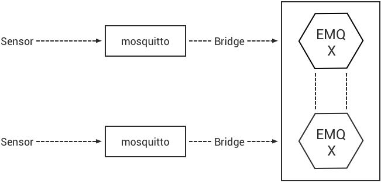

.. _bridge:

========
桥接转发
========

EMQ X企业版桥接转发MQTT消息到Kafka、RabbitMQ或其他EMQ X节点。同时支持mosquitto、rsmb以普通MQTT连接方式桥接到EMQ X。

.. _kafka_bridge:

---------
Kafka桥接
---------

EMQ X桥接转发MQTT消息到Kafka集群:

Kafka桥接插件配置文件: etc/plugins/emqx_bridge_kafka.conf。

配置Kafka集群地址
-----------------

.. code-block:: properties

    ## Kafka Server
    bridge.kafka.pool1.server = 127.0.0.1:9092

    ## Kafka Pool Size 
    bridge.kafka.pool1.pool_size = 8
    
    ## Kafka Parition Strategy
    bridge.kafka.parition_strategy = random

配置Kafka桥接规则
-----------------

.. code-block:: properties
    
    ## Client Connected Record Hook
    bridge.kafka.hook.client.connected.1 = {"action": "on_client_connected", "pool": "pool1", "topic": "client_connected"}

    ## Client Disconnected Record Hook
    bridge.kafka.hook.client.disconnected.1 = {"action": "on_client_disconnected", "pool": "pool1", "topic": "client_disconnected"}

    ## Session Subscribed Record Hook
    bridge.kafka.hook.session.subscribed.1 = {"action": "on_session_subscribed", "filter": "#", "pool": "pool1", "topic": "session_subscribed"}

    ## Session Unsubscribed Record Hook
    bridge.kafka.hook.session.unsubscribed.1 = {"action": "on_session_unsubscribed", "filter": "#", "pool": "pool1", "topic": "session_unsubscribed"}

    ## Message Publish Record Hook
    bridge.kafka.hook.message.publish.1 = {"action": "on_message_publish", "filter": "#", "pool": "pool1", "topic": "message_publish"}

    ## Message Delivered Record Hook
    bridge.kafka.hook.message.delivered.1 = {"action": "on_message_delivered", "filter": "#", "pool": "pool1", "topic": "message_delivered"}

    ## Message Acked Record Hook
    bridge.kafka.hook.message.acked.1 = {"action": "on_message_acked", "filter": "#", "pool": "pool1", "topic": "message_acked"}

Kafka桥接规则说明
-----------------

+------------------------+----------------------------------+
| action                 | 说明                             |
+========================+==================================+
| on_client_connected    | 客户端登录                       |
+------------------------+----------------------------------+
| on_client_disconnected | 客户端退出                       |
+------------------------+----------------------------------+
| on_session_subscribed  | 订阅主题                         |
+------------------------+----------------------------------+
| on_session_unsubscribed| 取消订阅主题                     |
+------------------------+----------------------------------+
| on_message_publish     | 发布消息                         |
+------------------------+----------------------------------+
| on_message_delivered   | delivered消息                    |
+------------------------+----------------------------------+
| on_message_acked       | ACK消息                          |
+------------------------+----------------------------------+

客户端上下线事件转发Kafka
-------------------------

设备上线 EMQ X转发上线事件消息到Kafka:

.. code-block:: javascript
    
    topic = "client_connected",
    value = {
             "client_id": ${clientid}, 
             "node": ${node}, 
             "ts": ${ts}
            }

设备下线 EMQ X转发下线事件消息到Kafka:

.. code-block:: javascript

    topic = "client_disconnected",
    value = {
            "client_id": ${clientid},
            "reason": ${reason},
            "node": ${node},
            "ts": ${ts}
            }

客户端订阅主题事件转发Kafka
---------------------------

.. code-block:: javascript
    
    topic = session_subscribed

    value = {
             "client_id": ${clientid},
             "topic": ${topic},
             "qos": ${qos},
             "node": ${node},
             "ts": ${timestamp}
            }

客户端取消订阅主题事件转发Kafka
--------------------------------

.. code-block:: javascript
    
    topic = session_unsubscribed

    value = {
             "client_id": ${clientid},
             "topic": ${topic},
             "qos": ${qos},
             "node": ${node},
             "ts": ${timestamp}
            }

MQTT消息转发到Kafka
-------------------

.. code-block:: javascript

    topic = message_publish

    value = {
             "client_id": ${clientid},
             "username": ${username},
             "topic": ${topic},
             "payload": ${payload},
             "qos": ${qos},
             "node": ${node}, 
             "ts": ${timestamp}
            }

MQTT消息派发(Deliver)事件转发Kafka
----------------------------------

.. code-block:: javascript
    
    topic = message_delivered

    value = {"client_id": ${clientid},
             "username": ${username},
             "from": ${fromClientId},
             "topic": ${topic},
             "payload": ${payload},
             "qos": ${qos},
             "node": ${node},
             "ts": ${timestamp}
            }

MQTT消息确认(Ack)事件转发Kafka
-------------------------------

.. code-block:: javascript
    
    topic = message_acked

    value = {
             "client_id": ${clientid},
             "username": ${username},
             "from": ${fromClientId},
             "topic": ${topic},
             "payload": ${payload},
             "qos": ${qos},
             "node": ${node},
             "ts": ${timestamp}
            }

Kafka消费示例
-------------

Kafka读取MQTT客户端上下线事件消息::

    sh kafka-console-consumer.sh --zookeeper localhost:2181 --topic client_connected --from-beginning

    sh kafka-console-consumer.sh --zookeeper localhost:2181 --topic client_disconnected --from-beginning

Kafka读取MQTT主题订阅事件消息::

    sh kafka-console-consumer.sh --zookeeper localhost:2181 --topic session_subscribed --from-beginning

    sh kafka-console-consumer.sh --zookeeper localhost:2181 --topic session_unsubscribed --from-beginning

Kafka读取MQTT发布消息::

    sh kafka-console-consumer.sh --zookeeper localhost:2181 --topic message_publish --from-beginning
    
Kafka读取MQTT消息发布(Deliver)、确认(Ack)事件::

    sh kafka-console-consumer.sh --zookeeper localhost:2181 --topic message_delivered --from-beginning
    
    sh kafka-console-consumer.sh --zookeeper localhost:2181 --topic message_acked --from-beginning
    
.. NOTE:: payload为base64编码

启用Kafka桥接插件
-----------------

.. code-block:: bash

    ./bin/emqx_ctl plugins load emqx_bridge_kafka

.. _rabbit_bridge:

------------
RabbitMQ桥接
------------

EMQ X桥接转发MQTT消息到RabbitMQ:

.. image:: _static/images/8_2.png

RabbitMQ桥接插件配置文件: etc/plugins/emqx_bridge_rabbit.conf。

配置RabbitMQ桥接地址
--------------------

.. code-block:: properties

    ## Rabbit Brokers Server
    bridge.rabbit.1.server = 127.0.0.1:5672

    ## Rabbit Brokers pool_size
    bridge.rabbit.1.pool_size = 4

    ## Rabbit Brokers username
    bridge.rabbit.1.username = guest

    ## Rabbit Brokers password
    bridge.rabbit.1.password = guest

    ## Rabbit Brokers virtual_host
    bridge.rabbit.1.virtual_host = /

    ## Rabbit Brokers heartbeat
    bridge.rabbit.1.heartbeat = 0

    # bridge.rabbit.2.server = 127.0.0.1:5672

    # bridge.rabbit.2.pool_size = 8

    # bridge.rabbit.1.username = guest

    # bridge.rabbit.1.password = guest

    # bridge.rabbit.1.virtual_host = /

    # bridge.rabbit.1.heartbeat = 0

配置RabbitMQ桥接规则
--------------------

.. code-block:: properties

    ## Bridge Hooks
    bridge.rabbit.hook.client.subscribe.1 = {"action": "on_client_subscribe", "rabbit": 1, "exchange": "direct:emq.subscription"}

    bridge.rabbit.hook.client.unsubscribe.1 = {"action": "on_client_unsubscribe", "rabbit": 1, "exchange": "direct:emq.unsubscription"}

    bridge.rabbit.hook.message.publish.1 = {"topic": "$SYS/#", "action": "on_message_publish", "rabbit": 1, "exchange": "topic:emq.$sys"}

    bridge.rabbit.hook.message.publish.2 = {"topic": "#", "action": "on_message_publish", "rabbit": 1, "exchange": "topic:emq.pub"}

    bridge.rabbit.hook.message.acked.1 = {"action": "on_message_acked", "rabbit": 1, "exchange": "topic:emq.acked"}

客户端订阅主题事件转发RabbitMQ
------------------------------

.. code-block:: javascript

    routing_key = subscribe
    exchange = emq.subscription
    headers = [{<<"x-emq-client-id">>, binary, ClientId}]
    payload = jsx:encode([{Topic, proplists:get_value(qos, Opts)} || {Topic, Opts} <- TopicTable])

客户端取消订阅事件转发RabbitMQ
------------------------------

.. code-block:: javascript

    routing_key = unsubscribe
    exchange = emq.unsubscription
    headers = [{<<"x-emq-client-id">>, binary, ClientId}]
    payload = jsx:encode([Topic || {Topic, _Opts} <- TopicTable]),

MQTT消息转发RabbitMQ
--------------------

.. code-block:: javascript

    routing_key = binary:replace(binary:replace(Topic, <<"/">>, <<".">>, [global]),<<"+">>, <<"*">>, [global])
    exchange = emq.$sys | emq.pub
    headers = [{<<"x-emq-publish-qos">>, byte, Qos},
               {<<"x-emq-client-id">>, binary, pub_from(From)},
               {<<"x-emq-publish-msgid">>, binary, emqx_base62:encode(Id)}]
    payload = Payload

MQTT消息确认(Ack)事件转发RabbitMQ
---------------------------------

.. code-block:: javascript

    routing_key = puback
    exchange = emq.acked
    headers = [{<<"x-emq-msg-acked">>, binary, ClientId}],
    payload = emqx_base62:encode(Id)

RabbitMQ订阅消费MQTT消息示例
----------------------------

Python RabbitMQ消费者代码示例:

.. code-block:: javascript

    #!/usr/bin/env python
    import pika
    import sys

    connection = pika.BlockingConnection(pika.ConnectionParameters(host='localhost'))
    channel = connection.channel()

    channel.exchange_declare(exchange='direct:emq.subscription', exchange_type='direct')

    result = channel.queue_declare(exclusive=True)
    queue_name = result.method.queue

    channel.queue_bind(exchange='direct:emq.subscription', queue=queue_name, routing_key= 'subscribe')

    def callback(ch, method, properties, body):
        print(" [x] %r:%r" % (method.routing_key, body))

    channel.basic_consume(callback, queue=queue_name, no_ack=True)

    channel.start_consuming()

其他语言RabbitMQ客户端代码示例::

    https://github.com/rabbitmq/rabbitmq-tutorials
    
启用RabbitMQ桥接插件
--------------------

.. code-block:: bash

    ./bin/emqx_ctl plugins load emqx_bridge_rabbit

.. _emqx_bridge:

---------
EMQ X桥接
---------

EMQ X支持多节点间桥接模式互联:

.. image:: _static/images/8_3.png

假设创建emqx1, emqx2两个节点:

+---------+--------------------+
| 目录    | 节点               |
+---------+--------------------+
| emqx1   | emqx1@192.168.1.10 |
+---------+--------------------+
| emqx2   | emqx2@192.168.1.20 |
+---------+--------------------+

启用emqx1, emqx2节点后，emqx1节点创建到emqx2桥接，转发全部'sensor/#'主题消息到emqx2:

.. code-block:: bash

    $ ./bin/emqx_ctl bridges start emqx2@192.168.1.20 sensor/#

    bridge is started.

    $ ./bin/emqx_ctl bridges list

    bridge: emqx1@127.0.0.1--sensor/#-->emqx2@127.0.0.1

测试emqx1--sensor/#-->emqx2的桥接:

.. code-block:: bash

    #emqx2节点上

    mosquitto_sub -t sensor/# -p 2883 -d

    #emqx1节点上

    mosquitto_pub -t sensor/1/temperature -m "37.5" -d

删除桥接:

.. code-block:: bash

    ./bin/emqx_ctl bridges stop emqx2@127.0.0.1 sensor/#

.. _mosquitto_bridge:

-------------
mosquitto桥接
-------------

mosquitto可以普通MQTT连接方式，桥接到EMQ X服务器集群:

mosquitto.conf桥接配置示例::

    connection emqx
    address 192.168.0.10:1883
    topic sensor/# out 2

    # Set the version of the MQTT protocol to use with for this bridge. Can be one
    # of mqttv31 or mqttv311. Defaults to mqttv31.
    bridge_protocol_version mqttv311

.. _rsmb_bridge:

--------
rsmb桥接
--------

rsmb以普通MQTT连接方式，桥接到 EMQ X服务器集群。

rsmb broker.cfg示例配置::

    connection emqx
    addresses 127.0.0.1:2883
    topic sensor/#

