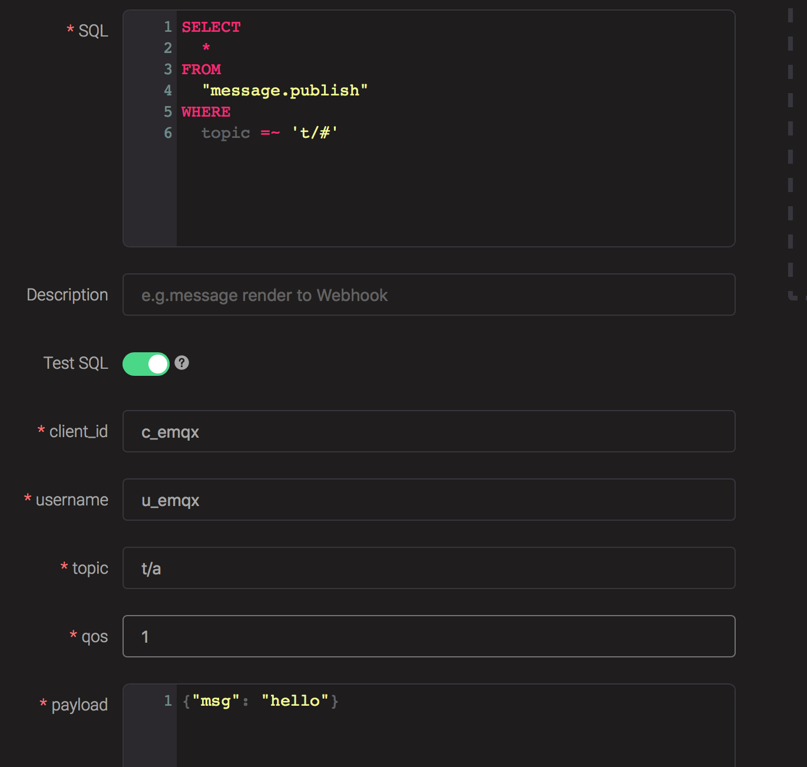
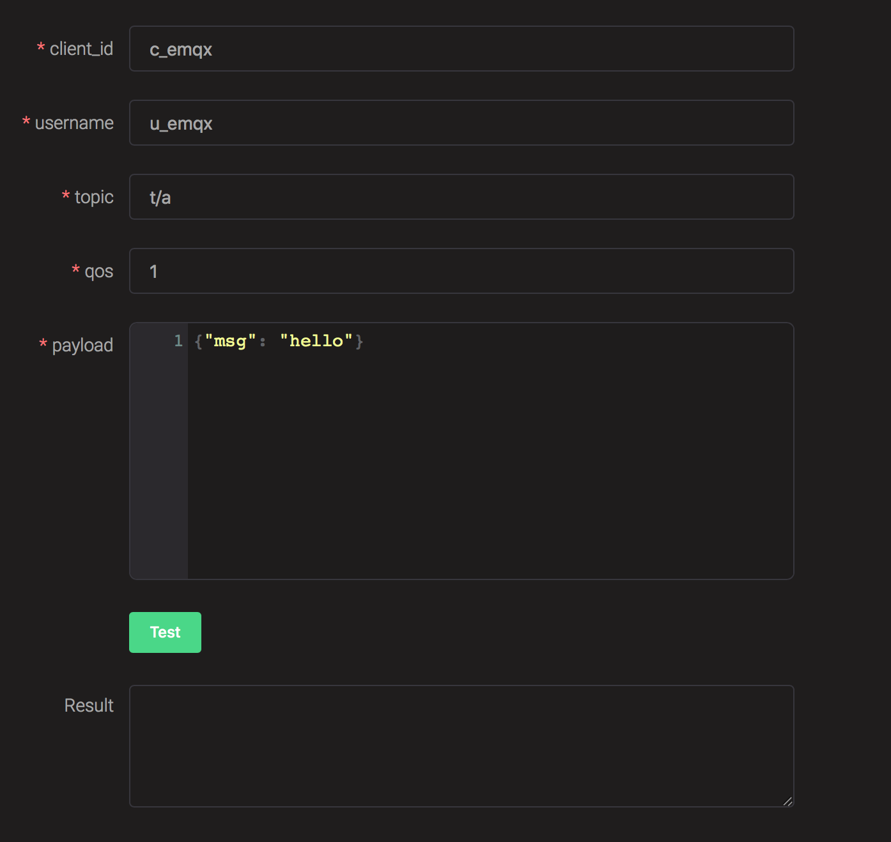
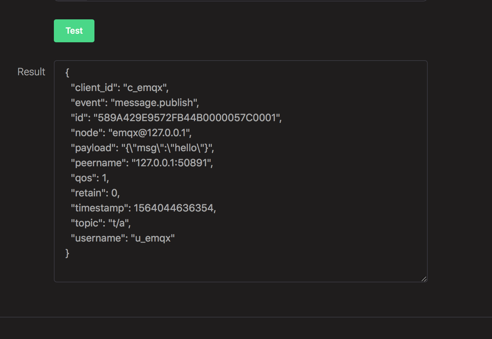
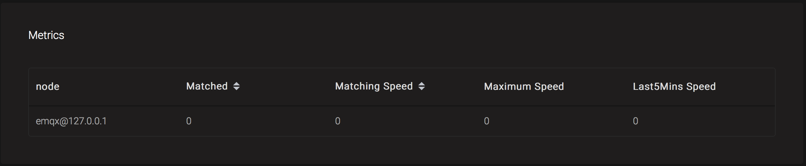
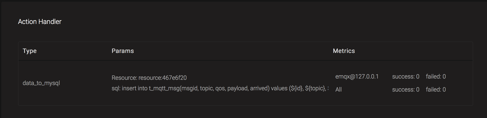
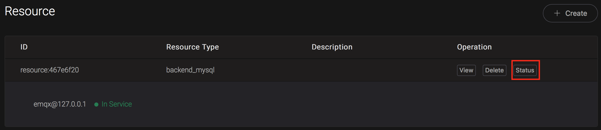

# Rule Engine

## EMQ X Rule Engine Introduction

Messages and events can be handled flexibly by the rule engine of EMQ X. Using the rule engine, it is convenient to implement such things as converting a message to a specified format, then saving it to a database table, or sending it to a message queue.

The concepts associated with the EMQ X rules engine include rule, action, resource, and resource-type.

**relationship between rule, action and resource.**

    Rule: {
        SQL statement,
        Action list: [
            {
                Action1,
                Action parameter,
                Binding resource: {
                  Resource configuration
                }
            },
            {
                Action2,
                Action parameter,
                Binding resource: {
                    Resource configuration
                }
            }, ...
        ]
    }

- Rule: Rule consists of SQL statements and action list. SQL statement is used to filter or transform data in events. An action is a task that is performed after a SQL statement is matched. The action list contains one or more actions and their parameters.
- Action: Action defines an operation for data. Actions can be bound to resources or not. For example, the "inspect" action does not need to bind resources, but simply prints the data content and action parameters. The "data_to_webserver" action needs to bind a resource of type web_hook with a URL configured in it.
- Resource: Resource is an object instantiated by a resource type as a template, and stores resource-related configurations (such as database connection address and port, user name, and password).
- Resource Type: Resource type is a static definition of a resource that describes the configuration items required for this type of resource.

::: warning Important
Action and resource type are provided by the code of emqx or plugins and cannot be dynamically created through the API and CLI.
:::

## SQL Statement

### SQL Syntax

SQL statement is used to filter out the fields from the original data according to the conditions and perform preprocessing and conversion. The basic format is:

    SELECT <field name> FROM <trigger event> [WHERE <condition>]

FROM、SELECT and WHERE clause:

- `FROM` clause mounts the rule to a trigger event, such as "message publish", "connection completed", "connection disconnected", etc.
- `SELECT` clause is used to filter or convert fields in an event.
- `WHERE` clause is used to filter events based on criteria.

### SQL Statement Example:

- Extract all fields from the message with topic "t/a":

      SELECT * FROM "message.publish" WHERE topic = 't/a'

- All fields extracted from message of 't/#' can be matched by topic. Note that the **'=~'** operator is used here for topic matching with wildcards:

      SELECT * FROM "message.publish" WHERE topic =~ 't/#'

- THe fields of qos，username and client_id extracted from message of 't/#' can be matched by topic:

      SELECT qos, username, client_id FROM "message.publish" WHERE topic =~ 't/#'

- Extract the username field from any topic message with the filter condition of username = 'Steven':

      SELECT username FROM "message.publish" WHERE username='Steven'

- Extract the x field from the payload of message with any topic and create the alias x for use in the WHERE clause. The WHERE clause is restricted as x = 1. Note that the payload must be in JSON format. Example: This SQL statement can match the payload {"x": 1}, but not to the payload {"x": 2}:

      SELECT payload.x as x FROM "message.publish" WHERE x=1

- Similar to the SQL statement above, but extract the data in the payload nestedly, and this SQL statement can match the payload {"x": {"y": 1}}:

      SELECT payload.x.y as a FROM "message.publish" WHERE a=1

- When client_id = 'c1' tries to connect, extract its source IP address and port number:

      SELECT peername as ip_port FROM "client.connected" WHERE client_id = 'c1'

- Filter all client_ids that subscribe to the 't/#' topic and subscription level is QoS1. Note that the strict equality operator **'='** is used here, so it does not match subscription requests with the subject 't' or 't/+/a':

      SELECT client_id FROM "client.subscribe" WHERE topic = 't/#' and qos = 1

- In fact, the topic and qos fields in the above example are aliases that are set for ease of use when the subscription request contains only one pair (Topic, QoS). However, if the Topic Filters in the subscription request contain multiple (Topic, QoS) combination pairs, then the contains_topic() or contains_topic_match() function must be explicitly used to check if the Topic Filters contain the specified (Topic, QoS):

      SELECT client_id FROM "client.subscribe" WHERE contains_topic(topic_filters, 't/#')

      SELECT client_id FROM "client.subscribe" WHERE contains_topic(topic_filters, 't/#', 1)

::: warning Important
The trigger event after the FROM clause needs to be enclosed in double quotes `""` .
The WHERE clause is followed by the filter condition. If the string is used, it needs to be enclosed in single quotes `''` . 
In the SELECT clause, if the `"."` symbol is sed to nest the payload, the payload must be in JSON format.
:::

### Trigger Event Available for the FROM Clause

| Event name          | Interpretation   |
| ------------------- | ---------------- |
| message.publish     | Message publish  |
| message.deliver     | Message delivery |
| message.acked       | Message acked    |
| message.dropped     | Message dropped  |
| client.connected    | Connect          |
| client.disconnected | Disconnect       |
| client.subscribe    | Subscribe        |
| client.unsubscribe  | Unsubscribe      |

### Fields Available for the SELECT Clause

The fields available to the SELECT clause are related to the type of trigger event, where `client_id` , `username` and `event` are common fields that is available for each event type .

#### message.publish

| client_id | Client ID                  |
| --------- | -------------------------- |
| username  | User name                  |
| event     | Fixed to "message.publish" |
| id        | MQTT message ID            |
| topic     | MQTT topic                 |
| payload   | MQTT payload               |
| peername  | Client IPAddress and Port  |
| qos       | MQTT message QoS           |
| timestamp | Timestamp                  |

#### message.deliver

| client_id   | Client ID                  |
| ----------- | -------------------------- |
| username    | User name                  |
| event       | Fixed to "message.deliver" |
| id          | MQTT message ID            |
| topic       | MQTT topic                 |
| payload     | MQTT payload               |
| peername    | Client IPAddress and Port  |
| qos         | MQTT message QoS           |
| timestamp   | Timestamp                  |
| auth_result | Authentication result      |
| mountpoint  | Message topic mountpoint   |

#### message.acked

| client_id | Client ID                 |
| --------- | ------------------------- |
| username  | User name                 |
| event     | Fixed to "message.acked"  |
| id        | MQTT message ID           |
| topic     | MQTT topic                |
| payload   | MQTT payload              |
| peername  | Client IPAddress and Port |
| qos       | MQTT message QoS          |
| timestamp | Timestamp                 |

#### message.dropped

| client_id | Client ID                  |
| --------- | -------------------------- |
| username  | User name                  |
| event     | Fixed to "message.dropped" |
| id        | MQTT message ID            |
| topic     | MQTT topic                 |
| payload   | MQTT payload               |
| peername  | Client IPAddress and Port  |
| qos       | MQTT message QoS           |
| timestamp | Timestamp                  |
| node      | Node name                  |

#### client.connected

| client_id    | Client ID                      |
| ------------ | ------------------------------ |
| username     | User name                      |
| event        | Fixed to "client.connected"    |
| auth_result  | Authentication result          |
| clean_start  | MQTT clean start Flag position |
| connack      | MQTT CONNACK result            |
| connected_at | Connection timestamp           |
| is_bridge    | Bridge or not                  |
| keepalive    | MQTT keepalive interval        |
| mountpoint   | Message topic mountpoint       |
| peername     | Client IPAddress and Port      |
| proto_ver    | MQTT Protocol version          |

#### client.disconnected

| client_id   | Client ID                      |
| ----------- | ------------------------------ |
| username    | User name                      |
| event       | Fixed to "client.disconnected" |
| auth_result | Authentication result          |
| mountpoint  | Message topic mountpoint       |
| peername    | Client IPAddress and Port      |
| reason_code | Reason code for disconnection  |

#### client.subscribe

| client_id     | Client ID                             |
| ------------- | ------------------------------------- |
| username      | User name                             |
| event         | Fixed to "client.subscribe"           |
| auth_result   | Authentication result                 |
| mountpoint    | Message topic mountpoint              |
| peername      | Client IPAddress and Port             |
| topic_filters | MQTT subscription list                |
| topic         | MQTT first topic of subscription list |
| Qos           | MQTT first QoS of subscription list   |

#### client.unsubscribe

| client_id     | Client ID                             |
| ------------- | ------------------------------------- |
| username      | User name                             |
| event         | Fixed to "client.unsubscribe"         |
| auth_result   | Authentication result                 |
| mountpoint    | Message topic mountpoint              |
| peername      | Client IPAddress and Port             |
| topic_filters | MQTT subscription list                |
| topic         | MQTT first topic of subscription list |
| QoS           | MQTT first QoS of subscription list   |

### Test SQL Statements in Dashboard

The Dashboard interface provides SQL statement testing capabilities to present SQL test results with given SQL statements and event parameters.

1. In the Rule Creation interface, enter **Rules SQL** and enable the **SQL Test** switch:

2. Modify the fields of the simulated event, or use the default configuration, click the **Test** button:

3. The processed results of the SQL will be displayed in the **Test Output** text box:

## Rule Engine Management Commands and HTTP API

### Rule Engine Command

#### Rules Command

| rules list                                              | List all rules |
| ------------------------------------------------------- | -------------- |
| rules show \<RuleId>                                    | Show a rule    |
| emqx_ctl rules create \<sql> \<actions> [-d [\<descr>]] | Create a rule  |
| rules delete \<RuleId>                                  | Delete a rule  |

#### rules create

Create a new rule. The parameters are as follows:

- \<sql>: rule SQL
- \<actions>: Action list in JSON format
- -d \<descr>: Optional, rule description information

Example:

    ## Create a test rule that simply prints all message content sent to the 't/a' topic
    $ ./bin/emqx_ctl rules create \
      'select * from "message.publish"' \
      '[{"name":"inspect", "params": {"a": 1}}]' \
      -d 'Rule for debug'

    Rule rule:9a6a725d created

The above example creates a rule with the ID `rule:9a6a725d` . There is only one action in the action list whose name is inspect, and the action parameter is `{"a": 1}` .

#### rules list

List all current rules:

    $ ./bin/emqx_ctl rules list

    rule(id='rule:9a6a725d', for='['message.publish']', rawsql='select * from "message.publish"', actions=[{"metrics":...,"name":"inspect","params":...}], metrics=..., enabled='true', description='Rule for debug')

#### rules show

Query rule:

    ## Query the rule with RuleID 'rule:9a6a725d'
    $ ./bin/emqx_ctl rules show 'rule:9a6a725d'

    rule(id='rule:9a6a725d', for='['message.publish']', rawsql='select * from "message.publish"', actions=[{"metrics":...,"name":"inspect","params":...}], metrics=..., enabled='true', description='Rule for debug')

#### rules delete

Delete rule:

    ## Delete rule with RuleID 'rule:9a6a725d'
    $ ./bin/emqx_ctl rules delete 'rule:9a6a725d'

    ok

#### Rule Actions Command

| rule-actions list [-k [\<eventype>]] | List actions       |
| ------------------------------------ | ------------------ |
| rule-actions show \<ActionId>        | Show a rule action |

::: tip Tip
Actions can be built in by emqx (called system built-in actions) or written by the emqx plugin, but they cannot be added or removed via the CLI/API.
:::

#### rule-actions show

Query action:

    ## Query the action named 'inspect'
    $ ./bin/emqx_ctl rule-actions show 'inspect'

    action(name='inspect', app='emqx_rule_engine', for='$any', types=[], title ='Inspect (debug)', description='Inspect the details of action params for debug purpose')

#### rule-actions list

List eligible actions:

    ## List all current actions
    $ ./bin/emqx_ctl rule-actions list

    action(name='data_to_rabbit', app='emqx_bridge_rabbit', for='$any', types=[bridge_rabbit], title ='Data bridge to RabbitMQ', description='Store Data to Kafka')
    action(name='data_to_timescaledb', app='emqx_backend_pgsql', for='$any', types=[timescaledb], title ='Data to TimescaleDB', description='Store data to TimescaleDB')
    ...

    ## List all actions that match the EventType type 'client.connected'
    ## '$any' indicates that this action can be bound to all types of events.
    $ ./bin/emqx_ctl rule-actions list -k 'client.connected'

    action(name='data_to_cassa', app='emqx_backend_cassa', for='$any', types=[backend_cassa], title ='Data to Cassandra', description='Store data to Cassandra')
    action(name='data_to_dynamo', app='emqx_backend_dynamo', for='$any', types=[backend_dynamo], title ='Data to DynamoDB', description='Store Data to DynamoDB')
    ...

#### resources command

| resources create \<type> [-c [\<config>]] [-d [\<descr>]] | Create a resource |
| --------------------------------------------------------- | ----------------- |
| resources list [-t \<ResourceType>]                       | List resources    |
| resources show \<ResourceId>                              | Show a resource   |
| resources delete \<ResourceId>                            | Delete a resource |

#### resources create

Create a new resource with parameters as follows:

- type: Resource Type
- -c config: JSON format configuration
- -d descr: Optional, description of the resource

      $ ./bin/emqx_ctl resources create 'web_hook' -c '{"url": "http://host-name/chats"}' -d 'forward msgs to host-name/chats'

      Resource resource:a7a38187 created

#### resources list

List all current resources:

    $ ./bin/emqx_ctl resources list

    resource(id='resource:a7a38187', type='web_hook', config=#{<<"url">> => <<"http://host-name/chats">>}, status=#{is_alive => false}, description='forward msgs to host-name/chats')

#### resources list by type

List all current resources:

    $ ./bin/emqx_ctl resources list --type='web_hook'

    resource(id='resource:a7a38187', type='web_hook', config=#{<<"url">> => <<"http://host-name/chats">>}, status=#{is_alive => false}, description='forward msgs to host-name/chats')

#### resources show

Query resource:

    $ ./bin/emqx_ctl resources show 'resource:a7a38187'

    resource(id='resource:a7a38187', type='web_hook', config=#{<<"url">> => <<"http://host-name/chats">>}, status=#{is_alive => false}, description='forward msgs to host-name/chats')

#### resources delete

Delete resource:

    $ ./bin/emqx_ctl resources delete 'resource:a7a38187'

    ok

#### resource-types command

| resource-types list         | List all resource-types |
| --------------------------- | ----------------------- |
| resource-types show \<Type> | Show a resource-type    |

::: tip Tip
Resource types can be built in by emqx (called system built-in resource types) or written by the emqx plugin, but cannot be added or removed via the CLI/API.
:::

#### resource-types list

List all current resource types:

    ./bin/emqx_ctl resource-types list

    resource_type(name='backend_mongo_rs', provider='emqx_backend_mongo', title ='MongoDB Replica Set Mode', description='MongoDB Replica Set Mode')
    resource_type(name='backend_cassa', provider='emqx_backend_cassa', title ='Cassandra', description='Cassandra Database')
    ...

#### resource-types show

Query resource type:

    $ ./bin/emqx_ctl resource-types show backend_mysql

    resource_type(name='backend_mysql', provider='emqx_backend_mysql', title ='MySQL', description='MySQL Database')

### Rule Engine HTTP API

#### Rule API

#### Create rule

API definition:

    POST api/v3/rules

Parameter definition:

| rawsql  | String，SQL statement for filtering and converting raw data |
| ------- | ----------------------------------------------------------- |
| actions | JSON Array，action list                                     |

- actions.name
                 |  String, action name

- actions.params
                     |  JSON Object, action parameter
  description | String，optional, rule description

API request example:

    GET http://localhost:8080/api/v3/rules

API request payload:

    {
      "rawsql": "select * from \"message.publish\"",
      "actions": [{
          "name": "inspect",
          "params": {
              "a": 1
          }
      }],
      "description": "test-rule"
    }

API returned data example:

    {
      "code": 0,
      "data": {
          "actions": [{
              "name": "inspect",
              "params": {
                  "a": 1
              }
          }],
          "description": "test-rule",
          "enabled": true,
          "for": "message.publish",
          "id": "rule:34476883",
          "rawsql": "select * from \"message.publish\""
      }
    }

#### Query rule

API definition:

    GET api/v3/rules/:id

API request example:

    GET api/v3/rules/rule:34476883

API returned data example:

    {
      "code": 0,
      "data": {
          "actions": [{
              "name": "inspect",
              "params": {
                  "a": 1
              }
          }],
          "description": "test-rule",
          "enabled": true,
          "for": "message.publish",
          "id": "rule:34476883",
          "rawsql": "select * from \"message.publish\""
      }
    }

#### Get the current rule list

API definition:

    GET api/v3/rules

API returned data example:

    {
      "code": 0,
      "data": [{
          "actions": [{
              "name": "inspect",
              "params": {
                  "a": 1
              }
          }],
          "description": "test-rule",
          "enabled": true,
          "for": "message.publish",
          "id": "rule:34476883",
          "rawsql": "select * from \"message.publish\""
      }]
    }

#### Delete rule

API definition:

    DELETE api/v3/rules/:id

Request parameter example:

    DELETE api/v3/rules/rule:34476883

API returned data example:

    {
      "code": 0
    }

#### Action API

#### Get the current action list

API definition:

    GET api/v3/actions?for=${hook_type}

API request example:

    GET api/v3/actions

API returned data example:

    {
      "code": 0,
      "data": [{
          "app": "emqx_rule_engine",
          "description": "Republish a MQTT message to another topic",
          "for": "message.publish",
          "name": "republish",
          "params": {
              "target_topic": {
                  "description": "To which topic the message will be republished",
                  "format": "topic",
                  "required": true,
                  "title": "To Which Topic",
                  "type": "string"
              }
          },
          "types": []
      }]
    }

API request example:

    GET 'api/v3/actions?for=client.connected'

API returned data example:

    {
      "code": 0,
      "data": [{
          "app": "emqx_rule_engine",
          "description": "Inspect the details of action params for debug purpose",
          "for": "$any",
          "name": "inspect",
          "params": {},
          "types": []
      }]
    }

#### Query action

API definition:

    GET api/v3/actions/:action_name

API request example:

    GET 'api/v3/actions/inspect'

API returned data example:

    {
      "code": 0,
      "data": {
          "app": "emqx_rule_engine",
          "description": "Inspect the details of action params for debug purpose",
          "for": "$any",
          "name": "inspect",
          "params": {},
          "types": []
      }
    }

#### Resource Type API

#### Get the current resource type list

API definition:

    GET api/v3/resource_types

Returned data example:

    {
      "code": 0,
      "data": [{
          "config": {
              "url": "http://host-name/chats"
          },
          "description": "forward msgs to host-name/chats",
          "id": "resource:a7a38187",
          "type": "web_hook"
      }]
    }

#### Query resource type

API definition:

    GET api/v3/resource_types/:type

Returned data example:

    GET api/v3/resource_types/web_hook

    {
      "code": 0,
      "data": {
          "description": "WebHook",
          "name": "web_hook",
          "params": {},
          "provider": "emqx_web_hook"
      }
    }

#### Get certain kind of resource

API definition:

    GET api/v3/resource_types/:type/resources

API request example:

    GET api/v3/resource_types/web_hook/resources

API returned data example:

    {
      "code": 0,
      "data": [{
          "config": {"url":"http://host-name/chats"},
          "description": "forward msgs to host-name/chats",
          "id": "resource:6612f20a",
          "type": "web_hook"
      }]
    }

#### Resource API

#### Create resource

API definition:

    POST api/v3/resources

API parameter definition:

| type        | String, resource type               |
| ----------- | ----------------------------------- |
| config      | JSON Object, resource configuration |
| description | String，Optional, rule description  |

API request parameter example:

    {
      "type": "web_hook",
      "config": {
          "url": "http://127.0.0.1:9910",
          "headers": {"token":"axfw34y235wrq234t4ersgw4t"},
          "method": "POST"
      },
      "description": "web hook resource-1"
    }

API returned data example:

    {
      "code": 0,
      "data": {
          "config": {
              "headers":{"token":"axfw34y235wrq234t4ersgw4t"},
              "method":"POST",
              "url":"http://127.0.0.1:9910"
          },
          "description": "web hook resource-1",
          "id": "resource:62763e19",
          "type": "web_hook"
      }
    }

#### Get resource list

API definition:

    GET api/v3/resources

API returned data example:

    {
      "code": 0,
      "data": [{
          "config": {
              "headers":{"token":"axfw34y235wrq234t4ersgw4t"},
              "method":"POST",
              "url":"http://127.0.0.1:9910"
          },
          "description": "web hook resource-1",
          "id": "resource:62763e19",
          "type": "web_hook"
      }]
    }

#### Query resource

API definition:

    GET api/v3/resources/:resource_id

API returned data example:

    GET 'api/v3/resources/resource:62763e19'

    {
      "code": 0,
      "data": {
          "config": {
              "headers":{"token":"axfw34y235wrq234t4ersgw4t"},
              "method":"POST",
              "url":"http://127.0.0.1:9910"
          },
          "description": "web hook resource-1",
          "id": "resource:62763e19",
          "type": "web_hook"
      }
    }

#### Delete resource

API definition:

    DELETE api/v3/resources/:resource_id

API returned data example:

    DELETE 'api/v3/resources/resource:62763e19'

    {
      "code": 0
    }

## Status, Statistical Indicator, and Alerts Related to the Rules Engine

### Rule Status and Statistical Indicators

- Hit: The hit number of rule (rule SQL matches successfully),
- Hit speed: the speed of the rule hit (times / second)
- Maximum hit speed: The peak of the rule hit speed (times / second)
- Average speed in five minutes: average hit speed of the rule within 5 minutes (times/second)

### Action Status and Statistical Indicators

- Success: Number of successful executions of action
- Failure: Number of failed executions of action

### Resource Status and Alarm

- Available: Resources is available
- Not available: Resource is not available (such as database disconnection)

## Example of Rule Creation

### Create Database and Bridge Rules through the CLI

`rule_engine_examples.cli.inspect`

`rule_engine_examples.cli.webhook`

### Create Database and Bridge Rules through DashBoard

`rule_engine_examples.dashboard.mysql`

`rule_engine_examples.dashboard.pgsql`

`rule_engine_examples.dashboard.cassa`

`rule_engine_examples.dashboard.mongo`

`rule_engine_examples.dashboard.dynamodb`

`rule_engine_examples.dashboard.redis`

`rule_engine_examples.dashboard.opentsdb`

`rule_engine_examples.dashboard.timescaledb`

`rule_engine_examples.dashboard.influxdb`

`rule_engine_examples.dashboard.webhook`

`rule_engine_examples.dashboard.kafka`

`rule_engine_examples.dashboard.pulsar`

`rule_engine_examples.dashboard.rabbit`

`rule_engine_examples.dashboard.bridge_mqtt`

`rule_engine_examples.dashboard.bridge_rpc`
