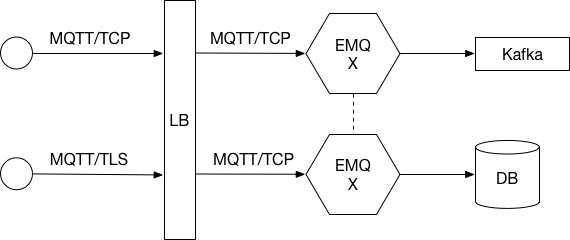

.. _deploy:

========
部署架构
========

EMQ X集群作为物联网接入服务(IoT Hub)，部署在青云、AWS、阿里等公有云或企业私有云平台。

典型部署结构:

------------
LB(负载均衡)
------------

LB(负载均衡器)负责分发设备的MQTT连接与消息到EMQ X集群，LB提高EMQ X集群可用性、实现负载平衡以及动态扩容。

部署架构推荐在LB终结SSL连接。设备与LB之间SSL安全连接，LB与EMQ X之间TCP连接。这种部署模式下EMQ X单集群可轻松支持100万设备。

公有云厂商LB产品:

+---------------+-----------------+----------------------------------------------------+
| 云计算厂商    | 是否支持SSL终结 | LB产品介绍                                         |
+===============+=================+====================================================+
| `青云`_       | 是              | https://docs.qingcloud.com/guide/loadbalancer.html |
+---------------+-----------------+----------------------------------------------------+
| `AWS`_        | 是              | https://aws.amazon.com/cn/elasticloadbalancing/    |
+---------------+-----------------+----------------------------------------------------+
| `阿里云`_     | 否              | https://www.aliyun.com/product/slb                 |
+---------------+-----------------+----------------------------------------------------+
| `UCloud`_     | 未知            | https://ucloud.cn/site/product/ulb.html            |
+---------------+-----------------+----------------------------------------------------+
| `QCloud`_     | 未知            | https://www.qcloud.com/product/clb                 |
+---------------+-----------------+----------------------------------------------------+

私有部署LB服务器:

+---------------+-----------------+------------------------------------------------------+
| 开源LB        | 是否支持SSL终结 | 方案介绍                                             |
+===============+=================+======================================================+
| `HAProxy`_    | 是              | https://www.haproxy.com/solutions/load-balancing.html|
+---------------+-----------------+------------------------------------------------------+
| `NGINX`_      | PLUS产品支持    | https://www.nginx.com/solutions/load-balancing/      |
+---------------+-----------------+------------------------------------------------------+

国内公有云部署推荐青云(EMQ合作伙伴)，国外部署推荐AWS。私有部署推荐使用HAPRoxy作为LB。

---------
EMQ X集群
---------

EMQ X节点集群部署在LB之后，建议部署在VPC或私有网络内。公有云厂商青云、AWS、UCloud、QCloud均支持VPC网络。

EMQ X默认开启的MQTT服务TCP端口:

+-----------+-----------------------------------+
| 1883      | MQTT协议端口                      |
+-----------+-----------------------------------+
| 8883      | MQTT/SSL端口                      |
+-----------+-----------------------------------+
| 8083      | MQTT/WebSocket端口                |
+-----------+-----------------------------------+
| 8084      | MQTT/WebSocket(SSL)端口           |
+-----------+-----------------------------------+

防火墙根据使用的MQTT接入方式，开启上述端口的访问权限。

EMQ X节点集群使用的TCP端口:

+-----------+-----------------------------------+
| 4369      | 集群节点发现端口                  |
+-----------+-----------------------------------+
| 5369      | 集群节点数据通道                  |
+-----------+-----------------------------------+
| 6369      | 集群节点控制通道                  |
+-----------+-----------------------------------+

集群节点间如有防护墙，需开启上述TCP端口互访权限。

-------------------
青云(QingCloud)部署
-------------------

1. 创建VPC网络。

2. VPC网络内创建EMQ X集群'私有网络'，例如: 192.168.0.0/24

3. 私有网络内创建两台EMQ X主机，例如:

    +-------+-------------+
    | emqx1 | 192.168.0.2 |
    +-------+-------------+
    | emqx2 | 192.168.0.3 |
    +-------+-------------+

4. 安装并集群EMQ X主机，具体配置请参考安装集群章节。

5. 创建LB(负载均衡器)并指定公网IP地址。

6. 在LB上创建MQTT TCP监听器::

                  -----
                  |   |
                  | L | --TCP 1883--> EMQ X
    --TCP 1883--> |   |
                  | B | --TCP 1883--> EMQ X
                  |   |
                  -----
 
   或创建SSL监听器，并终结SSL在LB::

                  -----
                  |   |
                  | L | --TCP 1883--> EMQ X
    --SSL 8883--> |   |
                  | B | --TCP 1883--> EMQ X
                  |   |
                  -----
  
7. MQTT客户端连接LB公网地址测试。

---------------
亚马逊(AWS)部署
---------------

1. 创建VPC网络。

2. VPC网络内创建EMQ X集群'私有网络'，例如: 192.168.0.0/24

3. 私有网络内创建两台EMQ X主机，指定上面创建的VPC网络,例如:

    +-------+-------------+
    | emqx1 | 192.168.0.2 |
    +-------+-------------+
    | emqx2 | 192.168.0.3 |
    +-------+-------------+

4. 在安全组中，开放MQTT服务的TCP端口，比如1883, 8883。

5. 安装并集群EMQ X主机，具体配置请参考安装集群章节。

6. 创建ELB(Classic负载均衡器)，指定VPC网络，并指定公网IP地址。

7. 在ELB上创建MQTT TCP监听器::

                 -----
                 |   |
                 | E | --TCP 1883--> EMQ X
    --TCP 1883-->| L |
                 | B | --TCP 1883--> EMQ X
                 |   |
                 -----

   或创建SSL监听器，并终结SSL在LB::

                 -----
                 |   |
                 | E | --TCP 1883--> EMQ X
    --SSL 8883-->| L |
                 | B | --TCP 1883--> EMQ X
                 |   |
                 -----

8. MQTT客户端连接LB公网地址测试。

----------
阿里云部署
----------

.. TODO:: 阿里云LB终结SSL?

------------
私有网络部署
------------

EMQ X集群直连
-------------

EMQ X集群直接挂在DNS，设备通过域名或者IP地址列表访问:

1. 部署EMQ X集群，具体参考`程序包安装`与`集群配置`文档。

2. EMQ X节点防火墙开启外部MQTT访问端口，例如1883, 8883。

3. 设备通过IP地址列表或域名访问EMQ X集群。

.. NOTE:: 不推荐这种部署方式。

HAProxy -> EMQ X
----------------

HAProxy作为LB部署EMQ X集群，并终结SSL连接:

1. 创建EMQ X集群节点，例如:

+-------+-------------+
| 节点  | IP地址      |
+=======+=============+
| emqx1 | 192.168.0.2 |
+-------+-------------+
| emqx2 | 192.168.0.3 |
+-------+-------------+

2. 配置/etc/haproxy/haproxy.cfg，示例::

    listen mqtt-ssl
        bind *:8883 ssl crt /etc/ssl/emqx/emqx.pem no-sslv3
        mode tcp
        maxconn 50000
        timeout client 600s
        default_backend emqx_nodes

    backend emqx_nodes
        mode tcp
        balance source
        timeout server 50s
        timeout check 5000
        server emqx1 192.168.0.2:1883 check inter 10000 fall 2 rise 5 weight 1
        server emqx2 192.168.0.3:1883 check inter 10000 fall 2 rise 5 weight 1
        source 0.0.0.0 usesrc clientip

NGINX Plus -> EMQ X
-------------------

NGINX Plus产品作为EMQ X集群的LB，并终结SSL连接:

1. 注册NGINX PLUS试用版，Ubuntu下安装: https://cs.nginx.com/repo_setup

2. 创建EMQ X节点集群，例如: 

+-------+-------------+
| 节点  | IP地址      |
+=======+=============+
| emqx1 | 192.168.0.2 |
+-------+-------------+
| emqx2 | 192.168.0.3 |
+-------+-------------+

3. 配置/etc/nginx/nginx.conf，示例::

    stream {
        # Example configuration for TCP load balancing

        upstream stream_backend {
            zone tcp_servers 64k;
            hash $remote_addr;
            server 192.168.0.2:1883 max_fails=2 fail_timeout=30s;
            server 192.168.0.3:1883 max_fails=2 fail_timeout=30s;
        }

        server {
            listen 8883 ssl;
            status_zone tcp_server;
            proxy_pass stream_backend;
            proxy_buffer_size 4k;
            ssl_handshake_timeout 15s;
            ssl_certificate     /etc/emqx/certs/cert.pem;
            ssl_certificate_key /etc/emqx/certs/key.pem;
        }
    }

========
程序安装
========

--------
环境要求
--------

操作系统
--------

EMQ X采用Erlang/OTP语言平台开发，可跨平台运行在Linux、FreeBSD、Mac OS X、Windows服务器。

产品环境推荐部署在64-bit Linux或FreeBSD云主机或服务器。

CPU/内存
--------

EMQ X在测试场景下，1G内存承载80K TCP连接，15K SSL安全连接。

产品部署环境下，建议双机集群，根据并发连接与消息吞吐，规划节点CPU/内存。

----------
程序包命名
----------

EMQ X每个版本会发布Ubuntu、CentOS、FreeBSD、Mac OS X、Windows平台程序包与Docker镜像。

联系EMQ公司获取程序包: http://emqtt.com/about#contacts

程序包命名由平台、版本组成，例如: emqx-enterprise-centos7-v2.1.0.zip

.. _install_rpm:

---------
RPM包安装
---------

CentOS、RedHat操作系统下，推荐RPM包安装。RPM包安装后可通过操作系统，直接管理启停EMQ服务。

RPM安装
-------

.. code-block:: console

    rpm -ivh --force emqx-centos6.8-v2.1.0-1.el6.x86_64.rpm

.. NOTE:: Erlang/OTP R19依赖lksctp-tools库

.. code-block:: console

    yum install lksctp-tools

配置文件
--------

EMQ X配置文件: /etc/emqx/emqx.conf，插件配置文件: /etc/emqx/plugins/\*.conf。

日志文件
--------

日志文件目录: /var/log/emqx

数据文件
--------

数据文件目录：/var/lib/emqx/

启动停止
--------

.. code-block:: console

    service emqx start|stop|restart

.. _install_deb:

---------
DEB包安装
---------

Debian、Ubuntu操作系统下，推荐DEB包安装。DEB包安装后可通过操作系统，直接管理启停EMQ服务。

.. code-block:: console

    sudo dpkg -i emqx-ubuntu16.04_v2.1.0_amd64.deb

.. NOTE:: Erlang/OTP R19依赖lksctp-tools库

.. code-block:: console

    apt-get install lksctp-tools

配置文件
--------

EMQ X配置文件: /etc/emqx/emqx.conf，插件配置文件: /etc/emqx/plugins/\*.conf。

日志文件
--------

日志文件目录: /var/log/emqx

数据文件
--------

数据文件目录：/var/lib/emqx/

启动停止
--------

.. code-block:: console

    service emqx start|stop|restart

.. _install_on_linux:

---------------
Linux通用包安装
---------------

EMQ X Linux通用程序包:

+---------------------+------------------------------------------+
|  操作系统           |                程序包                    |
+=====================+==========================================+
| CentOS6(64-bit)     | emqx-enterprise-centos6.8-v2.1.0.zip     |
+---------------------+------------------------------------------+
| CentOS7(64-bit)     | emqx-enterprise-centos7-v2.1.0.zip       |
+---------------------+------------------------------------------+
| Ubuntu16.04(64-bit) | emqx-enterprise-ubuntu16.04-v2.1.0.zip   |
+---------------------+------------------------------------------+
| Ubuntu14.04(64-bit) | emqx-enterprise-ubuntu14.04-v2.1.0.zip   |
+---------------------+------------------------------------------+
| Ubuntu12.04(64-bit) | emqx-enterprise-ubuntu12.04-v2.1.0.zip   |
+---------------------+------------------------------------------+
| Debian7(64-bit)     | emqx-enterprise-debian7-v2.1.0.zip       |
+---------------------+------------------------------------------+
| Debian8(64-bit)     | emqx-enterprise-debian8-v2.1.0.zip       |
+---------------------+------------------------------------------+

CentOS平台为例，下载安装过程:

.. code-block:: bash

    unzip emqx-enterprise-centos7-v2.1.0.zip

控制台调试模式启动，检查EMQ X是否可正常启动:

.. code-block:: bash

    cd emqx && ./bin/emqx console

如启动正常，控制台输出:

.. code-block:: bash

    Starting emqx on node emqx@127.0.0.1
    Load emqx_mod_presence module successfully.
    Load emqx_mod_subscription module successfully.
    dashboard:http listen on 0.0.0.0:18083 with 2 acceptors.
    mqtt:tcp listen on 127.0.0.1:11883 with 4 acceptors.
    mqtt:tcp listen on 0.0.0.0:1883 with 8 acceptors.
    mqtt:ws listen on 0.0.0.0:8083 with 4 acceptors.
    mqtt:ssl listen on 0.0.0.0:8883 with 4 acceptors.
    mqtt:wss listen on 0.0.0.0:8084 with 4 acceptors.
    emqx 2.1.0 is running now!

CTRL+c关闭控制台。守护进程模式启动:

.. code-block:: bash

    ./bin/emqx start

启动错误日志将输出在log/目录。

EMQ X服务进程状态查询:

.. code-block:: bash

    ./bin/emqx_ctl status

正常运行状态，查询命令返回:

.. code-block:: bash

    $ ./bin/emqx_ctl status
    Node 'emqx@127.0.0.1' is started
    emqx 2.1.0 is running

EMQ X服务器提供了状态监控URL::

    http://localhost:8083/status

停止服务器::

    ./bin/emqx stop

.. _install_on_freebsd:

-----------------
FreeBSD服务器安装
-----------------

联系EMQ公司获取程序包: http://emqtt.com/about#contacts

FreeBSD平台安装过程与Linux相同。

.. _install_on_mac:

----------------
Mac OS X系统安装
----------------

EMQ X Mac平台下安装启动过程与Linux相同。

Mac下开发调试MQTT应用，配置文件'etc/emqx.conf' log段落打开debug日志，控制台可以查看收发MQTT报文详细:

.. code-block:: properties

    ## Console log. Enum: off, file, console, both
    log.console = both

    ## Console log level. Enum: debug, info, notice, warning, error, critical, alert, emergency
    log.console.level = debug

    ## Console log file
    log.console.file = log/console.log

.. _install_docker:

--------------
Docker镜像安装
--------------

EMQ X Docker镜像获取:

解压emqx-enterprise-docker镜像包::

    unzip emqx-enterprise-docker-v2.1.0.zip

加载镜像::

    docker load < emqplus-enterprise-docker-v2.1.0

启动容器::

    docker run -itd --net='host' --name emqx20 emqx-enterprise-docker-v2.1.0

停止容器::

    docker stop emqx20

开启容器::

    docker start emqx20

进入Docker控制台::

    docker exec -it emqx20 /bin/bash

========
快速启动
========

假设部署两台EMQ X Linux节点集群，在云厂商VPC或私有网络内:

+---------------------+---------------------+
| 节点名              |    IP地址           |
+---------------------+---------------------+
| emqx1@192.168.0.10  | 192.168.0.10        |
+---------------------+---------------------+
| emqx@192.168.0.20   | 192.168.0.20        |
+---------------------+---------------------+

------------
操作系统参数
------------

EMQ X 在Linux环境下独立部署，支持10万线并发连接，需设置内核参数、TCP协议栈参数。

系统全局文件句柄
----------------

系统全局允许分配的最大文件句柄数256K:

.. code-block:: console

    # 2 millions system-wide
    sysctl -w fs.file-max=262144
    sysctl -w fs.nr_open=262144
    echo 262144 > /proc/sys/fs/nr_open

允许当前会话/进程打开文件句柄数:

.. code-block:: console

    ulimit -n 262144

/etc/sysctl.conf
----------------

持久化'fs.file-max'设置到/etc/sysctl.conf文件:

.. code-block:: console

    fs.file-max = 262144

/etc/security/limits.conf
-------------------------

/etc/security/limits.conf持久化设置允许用户/进程打开文件句柄数::

    emqx      soft   nofile      262144
    emqx      hard   nofile      262144

注: Ubuntu下需设置/etc/systemd/system.conf:

.. code-block:: properties

    DefaultLimitNOFILE=262144

--------------
EMQ X 节点名称
--------------

设置节点名称与Cookie(集群节点间通信认证)。

emqx1节点/etc/emqx/emqx.conf文件::

    node.name   = emqx1@192.168.0.10
    node.cookie = secret_dist_cookie

emqx2节点/etc/emqx/emqx.conf文件::

    node.name   = emqx2@192.168.0.20
    node.cookie = secret_dist_cookie

--------------
EMQ X 节点启动
--------------

如果RPM或DEB方式安装，启动节点::

    service emqx start

如果独立zip包安装，启动节点::
    
    ./bin/emqx start

--------------
EMQ X 节点集群
--------------

启动两台节点后，emqx1@192.168.0.10上执行::

    $ ./bin/emqx_ctl cluster join emqx2@192.168.0.20

    Join the cluster successfully.
    Cluster status: [{running_nodes,['emqx1@192.168.0.10','emqx@192.168.0.20']}]

或，emqx2@192.168.0.20上执行::

    $ ./bin/emqx_ctl cluster join emqx1@192.168.0.10

    Join the cluster successfully.
    Cluster status: [{running_nodes,['emqx1@192.168.0.10','emqx@192.168.0.20']}]

任意节点上查询集群状态::

    $ ./bin/emqx_ctl cluster status

    Cluster status: [{running_nodes,['emqx1@192.168.0.10','emqx@192.168.0.20']}]

--------------
Web 管理控制台
--------------

18083端口是Web管理控制占用，该端口由'emqx-dashboard'插件启用。

控制台URL: http:://localhost:18083/ ，默认登录用户名: admin, 密码: public。

用户可以通过控制台，查询集群节点、MQTT报文统计、MQTT客户端、MQTT会话与路由信息。

.. _tcp_ports:

---------------
MQTT服务TCP端口
---------------

EMQ X 默认启用的外部MQTT服务端口包括:

+-----------+-----------------------------------+
| 1883      | MQTT协议端口                      |
+-----------+-----------------------------------+
| 8883      | MQTT/SSL端口                      |
+-----------+-----------------------------------+
| 8083      | MQTT/WebSocket端口                |
+-----------+-----------------------------------+
| 8084      | MQTT/WebSocket(SSL)端口           |
+-----------+-----------------------------------+
| 18083     | Web管理控制台端口                 |
+-----------+-----------------------------------+

上述占用端口可通过etc/emqx.conf配置文件的'Listeners'段落设置:

.. code-block:: properties

    ## External TCP Listener: 1883, 127.0.0.1:1883, ::1:1883
    listener.tcp.external = 0.0.0.0:1883

    ## SSL Listener: 8883, 127.0.0.1:8883, ::1:8883
    listener.ssl.external = 8883
    
    ## HTTP and WebSocket Listener
    listener.http.external = 8083

    ## External HTTPS and WSS Listener
    listener.https.external = 8084

通过注释或删除相关段落，可禁用相关TCP服务启动。

---------------
节点集群TCP端口
---------------

EMQ X节点间防火墙必须开放下述端口:

+-----------+-----------------------------------+
| 4369      | 集群节点发现端口                  |
+-----------+-----------------------------------+
| 5369      | 集群节点数据通道                  |
+-----------+-----------------------------------+
| 6369      | 集群节点控制通道                  |
+-----------+-----------------------------------+

.. _青云:    https://qingcloud.com
.. _AWS:     https://aws.amazon.com
.. _阿里云:  https://www.aliyun.com
.. _UCloud:  https://ucloud.cn
.. _QCloud:  https://www.qcloud.com
.. _HAProxy: https://www.haproxy.org
.. _NGINX:   https://www.nginx.com 

