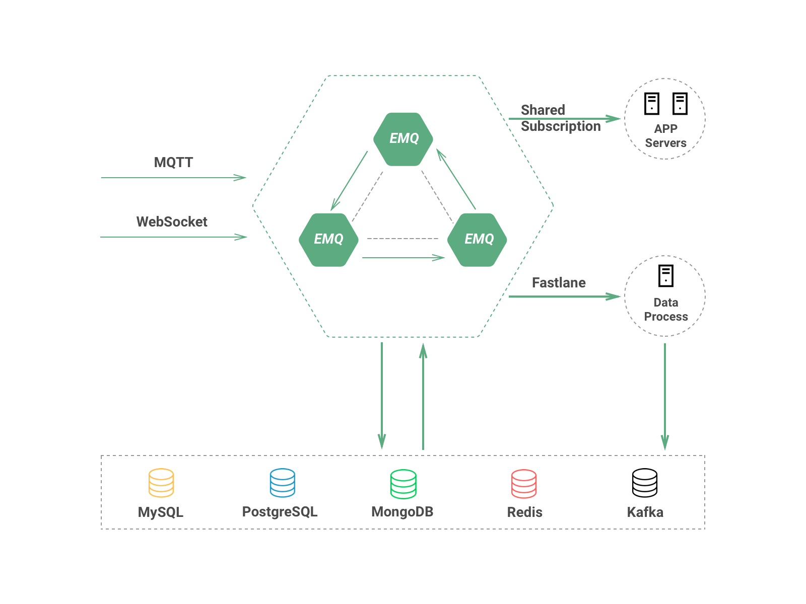

.. _overview:

=========
产品概述
=========

EMQ 是目前全球市场广泛应用的百万级开源MQTT消息服务器，全球市场(西欧、北美、印度、中国)累积超5000家企业用户，产品环境下部署超1万节点，累计下载量超过50万，承载MQTT连接超3000万线。

EMQ X 是基于EMQ开发设计的企业服务版本。EMQ X 企业版大幅改进系统设计架构，采用Scalable RPC 机制，支持更稳定的节点集群与更高性能的消息路由。

EMQ X 企业版支持MQTT消息数据存储Redis、MySQL、PostgreSQL、MongoDB、Cassandra多种数据库，支持桥接转发MQTT消息到Kafka、RabbitMQ企业消息中间件。

EMQ X 可以作为智能硬件、智能家居、物联网、车联网应用的百万级设备接入平台。

---------
设计目标
---------

EMQ 是基于Erlang/OTP平台开发的开源物联网MQTT消息服务器。Erlang/OTP是出色的软实时、低延时、分布式语言平台。MQTT是轻量的、发布订阅模式的物联网消息协议。

EMQ X 设计目标是实现企业级高可靠，并支持承载海量物联网终端的MQTT连接，支持在海量物联网设备间低延时消息路由:

1. 稳定承载大规模的MQTT客户端连接，单服务器节点支持50万到100万连接。

2. 分布式节点集群，快速低延时的消息路由，单集群支持1000万规模的路由。

3. 消息服务器内扩展，支持定制多种认证方式、高效存储消息到后端数据库。

4. 完整物联网协议支持，MQTT、MQTT-SN、CoAP、WebSocket或私有协议支持。

--------
产品功能
--------

1. Scalable RPC架构: 分离Erlang自身的集群通道与EMQ X节点间的数据通道。

2. Fastlane订阅: 专为数据采集型物联网应用提供的Fastlane快速消息路由。

3. Redis存储订阅关系、设备在线状态、MQTT消息、保留消息，发布SUB/UNSUB事件。

4. MySQL存储订阅关系、设备在线状态、MQTT消息、保留消息。

5. PostgreSQL存储订阅关系、设备在线状态、MQTT消息、保留消息。

6. MongoDB存储订阅关系、设备在线状态、MQTT消息、保留消息。

7. Kafka桥接：EMQ X 内置Bridge直接转发MQTT消息、设备上下线事件到Kafka。

8. RabbitMQ桥接：EMQ X 内置Bridge直接转发MQTT消息、设备上下线事件到RabbitMQ。

.. _scalable_rpc:

----------------
Scalable RPC架构
----------------

EMQ X 企业版改进了分布节点间的通信机制，分离Erlang自身的集群通道与EMQ的数据通道，大幅提高集群节点间的消息吞吐与集群稳定性:

.. NOTE:: 虚线为Erlang的分布集群通道，实线为节点间消息数据通道。

.. image:: _static/images/scalable_rpc.png

Scalable RPC配置::

    ## TCP server port.
    rpc.tcp_server_port = 5369

    ## Default TCP port for outgoing connections
    rpc.tcp_client_port = 5369

    ## Client connect timeout
    rpc.connect_timeout = 5000

    ## Client and Server send timeout
    rpc.send_timeout = 5000

    ## Authentication timeout
    rpc.authentication_timeout = 5000

    ## Default receive timeout for call() functions
    rpc.call_receive_timeout = 15000

    ## Socket keepalive configuration
    rpc.socket_keepalive_idle = 7200

    ## Seconds between probes
    rpc.socket_keepalive_interval = 75

    ## Probes lost to close the connection
    rpc.socket_keepalive_count = 9

.. NOTE:: 集群节点间如存在防火墙，必须打开5369端口。

.. _fastlane:

------------
Fastlane订阅
------------

EMQ X 企业版增加了快车道(Fastlane)订阅功能，大幅提高消息路由效率，非常适合数据采集类的物联网应用:

.. image:: _static/images/overview_2.png

Fastlane订阅使用方式: 主题加 *$fastlane/* 前缀。

Fastlane订阅限制:

1. CleanSession = true
2. Qos = 0

Fastlane订阅适合物联网传感器数据采集类应用:

.. image:: _static/images/overview_3.png

--------
代理订阅
--------

EMQ X 企业版支持服务端代理订阅功能，MQTT客户端上线后无需发送SUBSCRIBE请求，EMQ代理从Redis、MySQL等数据库帮客户端加载订阅。

EMQ X 代理订阅功能在低功耗、低带宽网络环境下，可以节省客户端到EMQ服务器的往返报文与流量。

------------
消息数据存储
------------

EMQ X 企业版支持存储订阅关系、MQTT消息、设备状态到Redis、MySQL、PostgreSQL、MongoDB与Cassandra数据库:

.. image:: _static/images/overview_4.png

数据存储相关配置，详见"数据存储"章节。

------------
消息桥接转发
------------

EMQ X 企业版支持直接转发MQTT消息到RabbitMQ、Kafka，可作为百万级的物联网接入服务器(IoT Hub):

.. image:: _static/images/overview_5.png

