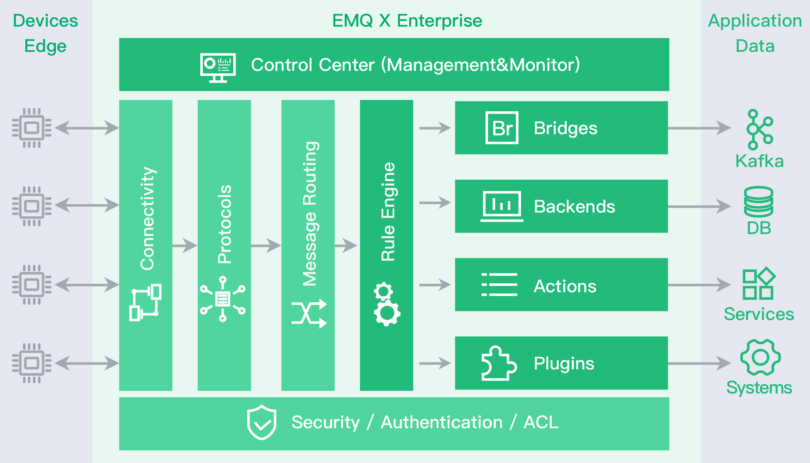

.. _overview:

=========
产品概述
=========

EMQ X 是目前全球市场广泛应用的百万级开源MQTT消息服务器，全球市场(西欧、北美、印度、中国)累积超5000家企业用户，产品环境下部署超1万节点，累计下载量超过50万，承载MQTT连接超3000万线。

EMQ X 企业版大幅改进系统设计架构，采用 Scalable RPC 机制，支持更稳定的节点集群与更高性能的消息路由。

EMQ X 企业版支持MQTT消息数据存储 Redis、MySQL、PostgreSQL、MongoDB、Cassandra、TimescaleDB、InfluxDB、DynamoDB、OpenTDSB 多种数据库。

EMQ X 企业版支持桥接转发MQTT消息到 Kafka、RabbitMQ、Pulsar、RocketMQ、MQTT Broker 企业消息中间件。

EMQ X 可以作为智能硬件、智能家居、物联网、车联网应用的百万级设备接入平台。

---------
设计目标
---------

EMQ X 是基于 Erlang/OTP 平台开发的开源物联网MQTT消息服务器。Erlang/OTP 是出色的软实时、低延时、分布式语言平台。MQTT是轻量的、发布订阅模式的物联网消息协议。

EMQ X 设计目标是实现企业级高可靠，并支持承载海量物联网终端的MQTT连接，支持在海量物联网设备间低延时消息路由:

1. 稳定承载大规模的 MQTT 客户端连接，单服务器节点支持50万到100万连接。

2. 分布式节点集群，快速低延时的消息路由，单集群支持1000万规模的路由。

3. 消息服务器内扩展，支持定制多种认证方式、高效存储消息到后端数据库。

4. 完整物联网协议支持，MQTT、MQTT-SN、CoAP、LwM2M、WebSocket 或私有协议支持。

--------
产品功能
--------

1. Scalable RPC架构: 分离 Erlang 自身的集群通道与 EMQ X 节点间的数据通道。

2. Redis 存储订阅关系、设备在线状态、MQTT 消息、保留消息，发布 SUB/UNSUB 事件。

3. MySQL 存储订阅关系、设备在线状态、MQTT 消息、保留消息。

4. PostgreSQL 存储订阅关系、设备在线状态、MQTT 消息、保留消息。

5. MongoDB 存储订阅关系、设备在线状态、MQTT 消息、保留消息。

6. Cassandra 存储订阅关系、设备在线状态、MQTT 消息、保留消息。

7. DynamoDB 存储订阅关系、设备在线状态、MQTT 消息、保留消息。

8. InfluxDB 存储 MQTT 时序消息。

9. OpenTDSB 存储 MQTT 时序消息。

10. TimescaleDB 存储 MQTT 时序消息。

11. Kafka 桥接：EMQ X 内置 Bridge 直接转发 MQTT 消息、设备上下线事件到 Kafka。

12. RabbitMQ 桥接：EMQ X 内置 Bridge 直接转发 MQTT 消息、设备上下线事件到 RabbitMQ。

13. Pulsar 桥接：EMQ X 内置 Bridge 直接转发 MQTT 消息、设备上下线事件到 Pulsar。

14. RocketMQ 桥接：EMQ X 内置 Bridge 直接转发 MQTT 消息、设备上下线事件到 RocketMQ。

15. Rule Engine：将 EMQ X 的事件、消息 转换成指定格式，然后存入数据库表，或者发送到消息队列等。

16. Schema Registry：将 EMQ X 的事件、消息 提供了数据编解码能力。

.. _scalable_rpc:

----------------
Scalable RPC架构
----------------

EMQ X 企业版改进了分布节点间的通信机制，分离 Erlang 自身的集群通道与 EMQ X 的数据通道，大幅提高集群节点间的消息吞吐与集群稳定性:

.. NOTE:: 虚线为 Erlang 的分布集群通道，实线为节点间消息数据通道。

.. image:: _static/images/scalable_rpc.png

Scalable RPC 配置::

    ## TCP server port for RPC.
    rpc.tcp_server_port = 5369

    ## TCP port for outgoing RPC connections.
    rpc.tcp_client_port = 5369

    ## RCP Client connect timeout.
    rpc.connect_timeout = 5s

    ## TCP send timeout of RPC client and server.
    rpc.send_timeout = 5s

    ## Authentication timeout
    rpc.authentication_timeout = 5s

    ## Default receive timeout for call() functions
    rpc.call_receive_timeout = 15s

    ## Socket idle keepalive.
    rpc.socket_keepalive_idle = 900s

    ## TCP Keepalive probes interval.
    rpc.socket_keepalive_interval = 75s

    ## Probes lost to close the connection
    rpc.socket_keepalive_count = 9

.. NOTE:: 集群节点间如存在防火墙，必须打开5369端口。

--------
代理订阅
--------

EMQ X 企业版支持服务端代理订阅功能，MQTT 客户端上线后无需发送 SUBSCRIBE 请求，EMQ X 代理从 Redis、MySQL 等数据库帮客户端加载订阅。

EMQ X 代理订阅功能在低功耗、低带宽网络环境下，可以节省客户端到 EMQ X 服务器的往返报文与流量。

------------
消息数据存储
------------

EMQ X 企业版支持存储订阅关系、MQTT 消息、设备状态到 Redis、MySQL、PostgreSQL、MongoDB、Cassandra、TimescaleDB、InfluxDB、DynamoDB、OpenTDSB 数据库:

.. image:: _static/images/overview_4.png

数据存储相关配置，详见"数据存储"章节。

------------
消息桥接转发
------------

EMQ X 企业版支持直接转发 MQTT 消息到 RabbitMQ、Kafka、Pulsar、RocketMQ、MQTT Broker，可作为百万级的物联网接入服务器(IoT Hub):

.. image:: _static/images/overview_5.png

---------
规则引擎
---------

EMQ X 规则引擎可以灵活地处理消息和事件。EMQ X 企业版规则引擎支持消息重新发布；桥接数据到 Kafka、Pulsar、RocketMQ、RabbitMQ、MQTT Broker；保存数据到 MySQL、PostgreSQL、Redis、MongoDB、DynamoDB、Cassandra、InfluxDB、OpenTSDB、TimescaleDB；发送数据到 WebServer:

.. image:: _static/images/overview_6.png

规则引擎相关配置，详见"规则引擎"章节。
